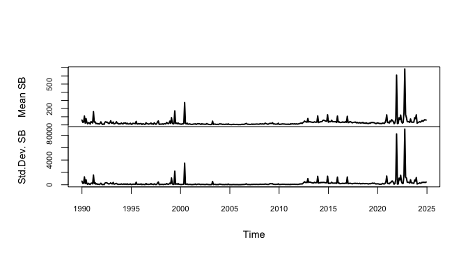
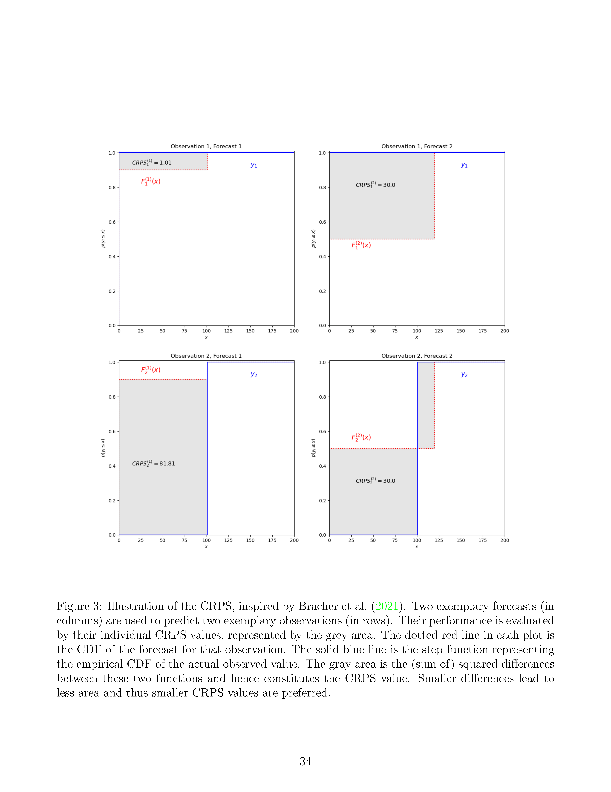
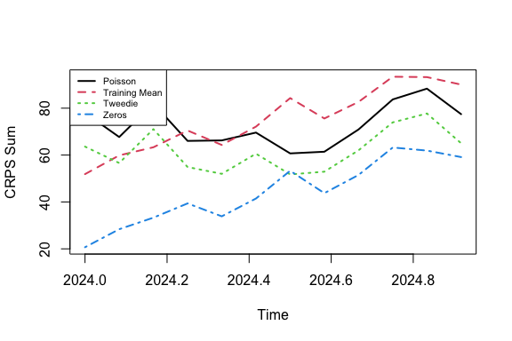

VIEWS Data Setup and Modeling Demo
================
Patrick T. Brandt

May 27, 2025

- [Introduction](#introduction)
- [Country-Month Data setup](#country-month-data-setup)
- [Package loads](#package-loads)
  - [Reading in data](#reading-in-data)
  - [Basic data manipulation for
    country-months](#basic-data-manipulation-for-country-months)
- [Basic Time Series Plots of all the SB killings
  data](#basic-time-series-plots-of-all-the-sb-killings-data)
- [Distributional summaries](#distributional-summaries)
  - [Some key time series summaries of
    variation](#some-key-time-series-summaries-of-variation)
  - [Simple model choices for `cm`
    data](#simple-model-choices-for-cm-data)
- [Tweedie distribution models](#tweedie-distribution-models)
  - [Definition](#definition)
  - [Properties](#properties)
  - [Illustration](#illustration)
- [Tweedie models for ’`cm` data](#tweedie-models-for-cm-data)
- [Time series parameter summaries](#time-series-parameter-summaries)
- [Simple prediction models](#simple-prediction-models)
  - [Basic count regressions](#basic-count-regressions)
  - [Demo of the count models over train-test
    splits](#demo-of-the-count-models-over-train-test-splits)
- [Practical Forecast Scoring](#practical-forecast-scoring)
  - [Basics of Scoring Forecasts](#basics-of-scoring-forecasts)
  - [Scoring forecasts](#scoring-forecasts)
  - [Scoring with simple metrics](#scoring-with-simple-metrics)
  - [Forecast Formatting](#forecast-formatting)
  - [Calibration & Sharpness](#calibration--sharpness)
  - [CRPS: measures calibration and
    sharpness](#crps-measures-calibration-and-sharpness)
  - [CRPS formula](#crps-formula)
  - [A CRPS Visual](#a-crps-visual)
  - [CRPS in practice](#crps-in-practice)
  - [CRPS for `cm` models](#crps-for-cm-models)
  - [Metrics over time horizons](#metrics-over-time-horizons)
  - [Forecasts and metrics on a country
    basis](#forecasts-and-metrics-on-a-country-basis)
- [Additional forecast metrics](#additional-forecast-metrics)
  - [Taylor Diagrams](#taylor-diagrams)
  - [Taylor Diagram math](#taylor-diagram-math)
  - [Taylor Diagram example code](#taylor-diagram-example-code)
  - [Standard Deviation Ratios](#standard-deviation-ratios)
  - [Skill scores](#skill-scores)
- [Exercises: `cm` models with
  covariates](#exercises-cm-models-with-covariates)
  - [Exercise 0: Baseline Tweedie
    model](#exercise-0-baseline-tweedie-model)
  - [Exercise 1: Climate variables](#exercise-1-climate-variables)
  - [Exercise 2: Demography](#exercise-2-demography)
  - [Exercise 3: Civil-Military
    Expenditures](#exercise-3-civil-military-expenditures)
  - [Exercise 4: Extract out predictions by region or
    country](#exercise-4-extract-out-predictions-by-region-or-country)
- [References](#references)

# Introduction

This demo shows how to read and process the initial data from VIEWS /
UCDP. This is based on the data from [VIEWS](https://viewsforecast.org).
Here the files are downloaded from the Dropbox location for the data.
Alternative version would be direct calls to the
[API](https://github.com/prio-data/views_api/wiki/Available-datasets).

# Country-Month Data setup

Here begin with setting up the training data as provided by
[ViEWS](https://viewsforecasting.org/prediction-competition-2/). This
takes the data as given from ViEWS and reads it into several data frames
and some subsets. The next few steps do this initially so that one gets
all of the necessary data in one place at the beginning of the analysis
that follow.

# Package loads

This section handles loading all packages then used below. This will
able be able to allow R Studio to handle in one section any installs /
loads / libraries needed below.

``` r
rm(list=ls())  # Clean start, I know...
library(arrow)
library(plotly)
library(tidyr)
library(ggplot2)
library(statmod)
library(tweedie)
library(MASS)
library(pscl)
library(zoo)
library(scoringutils)
library(magrittr)
#### Taylor diagram ####
library(openair)
```

## Reading in data

This section shows how to automatically download and read in the
training data for the VIEWS `cm` to `R`.

*If you run your own local version of this, you may likely need to
change the paths to the input files.* Here are links for the
[codebooks](https://viewsforecasting.org/wp-content/uploads/cm_features_competition.pdf)
or
[here](https://www.dropbox.com/scl/fo/rkj4ttawoz9pv6x35r9cq/ACNAhhWCn6wCJvSv8ZeyMu4/cm_level_data?dl=0&preview=ideas_fastforward_2025_cm_features.pdf&rlkey=44eg0kk4w8yh8tm1f53vvpzps&subfolder_nav_tracking=1)
and [input
files](https://www.dropbox.com/scl/fo/rkj4ttawoz9pv6x35r9cq/APSd_RJxvk-fpNAteD4J1iY?rlkey=44eg0kk4w8yh8tm1f53vvpzps&e=1&st=r0qv5cz1&dl=0).

This does take some time initially. (Once you have these files locally
you can bypass this section or alter this to run locally!)

``` r
# CM level data: features and outcomes path
dl_link <- "https://www.dropbox.com/scl/fo/rkj4ttawoz9pv6x35r9cq/ACi53p087OvQUke0pIg88pg/cm_level_data/cm_data_121_542.parquet?rlkey=44eg0kk4w8yh8tm1f53vvpzps&dl=1"

# File name once downloaded
destfile <- "cm_data_121_542.parquet"

# DL with curl
curl::curl_download(url = dl_link, destfile = destfile)

# This is the main data file being read into R
cm <- read_parquet("cm_data_121_542.parquet")

###
## Repeat the above with the data for the country labels and the month ids
##

# Get the list of country names as well to add to the data
# These are from the main VIEWS site
dl_link2 <- "https://www.dropbox.com/scl/fo/rurpcmtpcquni5onoyuus/AGeR6dD-Ru-Emwn06HnKAE8/matching_tables?preview=countries.csv&rlkey=v1o4va647qrwc4la7m8i7cedk&subfolder_nav_tracking=1&st=goucd0hg&dl=1"

# File name declared
destfile2 <- "country.zip"

# DL with curl
curl::curl_download(url = dl_link2, destfile = destfile2)

# Unzip
zip::unzip(zipfile = "country.zip", exdir="countries")

# Read it
countries <- read.csv("countries/countries.csv", header = TRUE)

# Month to date maps
dl_link3 <- "https://www.dropbox.com/scl/fo/rurpcmtpcquni5onoyuus/AGeR6dD-Ru-Emwn06HnKAE8/matching_tables?preview=month_ids.csv&rlkey=v1o4va647qrwc4la7m8i7cedk&subfolder_nav_tracking=1&st=l8g86mv4&dl=1"

destfile3 <- "month_ids.zip"
curl::curl_download(url = dl_link3, destfile = destfile3)
zip::unzip(zipfile = "month_ids.zip", exdir="month_ids")
month_ids <- read.csv("month_ids/month_ids.csv", header = TRUE)

# Save the downloaded data for later -- so this is all in one image!

save.image("VIEWS-alldownloaded.RData")
```

Note the above will also have downloaded the `pgm` items for the months
and the countries, so this is available for later processing. Adding the
`pgm` training data would need to be added to the above if desired. But
the basic idea is mapped out here.

## Basic data manipulation for country-months

This section merges or aligns the dates and country codes so that the
identifiers can always be put back into the data for case
identifications. This is a set of `merge` commands using base R.

``` r
# Subset out the main (conflict) variables we want
df1 <- subset(cm, select = c(month_id, country_id,
                             gleditsch_ward,
                             ged_sb, ged_ns, ged_os, 
                             acled_sb, acled_sb_count,
                             acled_os))

# Merge on the country label data
dfs <- merge(df1, countries, 
             by.x = "country_id", by.y="id")

# Merge on the time periods info
dfs <- merge(dfs, month_ids[,2:4],
             by.x = "month_id", by.y="month_id")

# Clean up
rm(df1)
```

If you want more variables in a data frame for analysis they can be
added as arguments to the `subset()` call.

One can now subset from an object like `dfs` in several ways using all
the usual tools. Just pulling out the data for Libya or by date would be
like this:

``` r
# Pull out rows for Libya
Libya <- dfs[dfs$isoab=="LBY",]
str(Libya)
```

    ## 'data.frame':    420 obs. of  18 variables:
    ##  $ month_id      : int  121 122 123 124 125 126 127 128 129 130 ...
    ##  $ country_id    : int  213 213 213 213 213 213 213 213 213 213 ...
    ##  $ gleditsch_ward: int  620 620 620 620 620 620 620 620 620 620 ...
    ##  $ ged_sb        : int  0 0 0 0 0 0 0 0 0 0 ...
    ##  $ ged_ns        : int  0 0 0 0 0 0 0 0 0 0 ...
    ##  $ ged_os        : int  0 0 0 0 0 0 0 0 0 0 ...
    ##  $ acled_sb      : num  0 0 0 0 0 0 0 0 0 0 ...
    ##  $ acled_sb_count: num  0 0 0 0 0 0 0 0 0 0 ...
    ##  $ acled_os      : num  8 8 8 8 8 8 8 8 8 8 ...
    ##  $ name          : chr  "Libya" "Libya" "Libya" "Libya" ...
    ##  $ gwcode        : int  620 620 620 620 620 620 620 620 620 620 ...
    ##  $ isoname       : chr  "Libyan Arab Jamahiriya" "Libyan Arab Jamahiriya" "Libyan Arab Jamahiriya" "Libyan Arab Jamahiriya" ...
    ##  $ isoab         : chr  "LBY" "LBY" "LBY" "LBY" ...
    ##  $ isonum        : int  434 434 434 434 434 434 434 434 434 434 ...
    ##  $ in_africa     : int  1 1 1 1 1 1 1 1 1 1 ...
    ##  $ in_middle_east: int  0 0 0 0 0 0 0 0 0 0 ...
    ##  $ Month         : int  1 2 3 4 5 6 7 8 9 10 ...
    ##  $ Year          : int  1990 1990 1990 1990 1990 1990 1990 1990 1990 1990 ...

``` r
# All data since 2022
post21 <- dfs[dfs$Year>2021,]

str(post21)
```

    ## 'data.frame':    6876 obs. of  18 variables:
    ##  $ month_id      : int  505 505 505 505 505 505 505 505 505 505 ...
    ##  $ country_id    : int  77 53 37 147 24 81 32 132 223 92 ...
    ##  $ gleditsch_ward: int  970 451 395 811 41 461 91 696 750 372 ...
    ##  $ ged_sb        : int  0 0 0 0 0 0 0 3 35 0 ...
    ##  $ ged_ns        : int  0 0 0 0 0 0 0 0 1 0 ...
    ##  $ ged_os        : int  0 0 0 0 0 0 0 0 7 0 ...
    ##  $ acled_sb      : num  0 0 0 0 0 0 0 0 24 0 ...
    ##  $ acled_sb_count: num  0 0 0 0 0 0 0 5 17 0 ...
    ##  $ acled_os      : num  0 0 0 0 21 0 40 3 34 0 ...
    ##  $ name          : chr  "Kiribati" "Sierra Leone" "Iceland" "Cambodia" ...
    ##  $ gwcode        : int  970 451 395 811 41 461 91 696 750 372 ...
    ##  $ isoname       : chr  "Kiribati" "Sierra Leone" "Iceland" "Cambodia" ...
    ##  $ isoab         : chr  "KIR" "SLE" "ISL" "KHM" ...
    ##  $ isonum        : int  296 694 352 116 332 768 340 784 356 268 ...
    ##  $ in_africa     : int  0 1 0 0 0 1 0 0 0 0 ...
    ##  $ in_middle_east: int  0 0 0 0 0 0 0 1 0 0 ...
    ##  $ Month         : int  1 1 1 1 1 1 1 1 1 1 ...
    ##  $ Year          : int  2022 2022 2022 2022 2022 2022 2022 2022 2022 2022 ...

``` r
# Clean ip
rm(post21)
```

Note this gives us what we would expect:

1.  For Libya there are 30 years of monthly data, or 420 observations.
2.  The `post21` object covers 3 years over 12 months for 191 countries:
    $`3 \times 12 \times 191 = 6876`$.

# Basic Time Series Plots of all the SB killings data

This summarizes and plots the GED state-based deaths series in `ged_sb`.
The goal in the next part is to

1.  extract the data by month
2.  summarize the mean and standard deviation for each month
3.  plot these monthly statistics as time series

``` r
#### Simple plots as checks ####

# Simple summary plot to see that we have things correct...
ms <- sort(unique(dfs$month_id))

roll.ged.sb <- matrix(NA, nrow=length(ms), ncol=3)
sbdata <- vector(mode="list", length=length(ms))

for(i in 1: length(ms))
{
  # Subset out one month of data at a time
  sb <- dfs[dfs$month_id==ms[i],]$ged_sb 
  sbdata[[i]] <- as.vector(unlist(sb))
  
  # Compute and store monthly means and sd
  roll.ged.sb[i,] <- c(ms[i], mean(sbdata[[i]]), sd(sbdata[[i]]))
}

rm(sb)

# Declare as time series and add variable names
roll.ged.sb <- ts(roll.ged.sb[,2:3], start=c(1990,1), freq=12)
colnames(roll.ged.sb) <- c("Mean SB", "Std.Dev. SB")

# Plot the results
plot(roll.ged.sb, lwd=2, col=1:2, main="", 
     cex.lab=0.9, cex.axis=0.7)
```



# Distributional summaries

Here look at the main variable from UCDP GED, the state-based deaths in
the `ged_sb` variable. (This can be repeated later for the other target
measures in the `dfs` object.). Here we compute the summarize the main
quantiles from the 75th to the 99th:

``` r
sb_quantiles <- by(dfs$ged_sb, dfs$Year, quantile, 
                   probs=c(0.75,0.85,0.95,0.99))

print(sb_quantiles)
```

    ## dfs$Year: 1990
    ##    75%    85%    95%    99% 
    ##   0.00   0.00  55.65 642.86 
    ## ------------------------------------------------------------ 
    ## dfs$Year: 1991
    ##    75%    85%    95%    99% 
    ##   0.00   0.00  52.85 587.10 
    ## ------------------------------------------------------------ 
    ## dfs$Year: 1992
    ##    75%    85%    95%    99% 
    ##   0.00   0.00  50.00 446.27 
    ## ------------------------------------------------------------ 
    ## dfs$Year: 1993
    ##    75%    85%    95%    99% 
    ##   0.00   0.00  47.00 501.92 
    ## ------------------------------------------------------------ 
    ## dfs$Year: 1994
    ##   75%   85%   95%   99% 
    ##   0.0   0.0  57.0 477.9 
    ## ------------------------------------------------------------ 
    ## dfs$Year: 1995
    ##    75%    85%    95%    99% 
    ##   0.00   0.00  55.00 385.71 
    ## ------------------------------------------------------------ 
    ## dfs$Year: 1996
    ##    75%    85%    95%    99% 
    ##   0.00   0.00  40.00 309.28 
    ## ------------------------------------------------------------ 
    ## dfs$Year: 1997
    ##    75%    85%    95%    99% 
    ##   0.00   0.00  58.00 340.28 
    ## ------------------------------------------------------------ 
    ## dfs$Year: 1998
    ##    75%    85%    95%    99% 
    ##   0.00   0.00  61.85 423.42 
    ## ------------------------------------------------------------ 
    ## dfs$Year: 1999
    ##    75%    85%    95%    99% 
    ##   0.00   0.00  62.85 367.83 
    ## ------------------------------------------------------------ 
    ## dfs$Year: 2000
    ##    75%    85%    95%    99% 
    ##   0.00   0.00  61.50 286.75 
    ## ------------------------------------------------------------ 
    ## dfs$Year: 2001
    ##    75%    85%    95%    99% 
    ##   0.00   0.00  46.25 229.13 
    ## ------------------------------------------------------------ 
    ## dfs$Year: 2002
    ##    75%    85%    95%    99% 
    ##   0.00   0.00  37.40 262.92 
    ## ------------------------------------------------------------ 
    ## dfs$Year: 2003
    ##   75%   85%   95%   99% 
    ##   0.0   0.0  33.0 170.7 
    ## ------------------------------------------------------------ 
    ## dfs$Year: 2004
    ##   75%   85%   95%   99% 
    ##   0.0   0.0  44.0 157.6 
    ## ------------------------------------------------------------ 
    ## dfs$Year: 2005
    ##    75%    85%    95%    99% 
    ##   0.00   0.00  24.00 153.35 
    ## ------------------------------------------------------------ 
    ## dfs$Year: 2006
    ##    75%    85%    95%    99% 
    ##   0.00   0.00  27.00 209.85 
    ## ------------------------------------------------------------ 
    ## dfs$Year: 2007
    ##    75%    85%    95%    99% 
    ##   0.00   0.00  28.65 202.99 
    ## ------------------------------------------------------------ 
    ## dfs$Year: 2008
    ##    75%    85%    95%    99% 
    ##   0.00   0.00  29.00 437.46 
    ## ------------------------------------------------------------ 
    ## dfs$Year: 2009
    ##    75%    85%    95%    99% 
    ##   0.00   0.00  34.00 401.05 
    ## ------------------------------------------------------------ 
    ## dfs$Year: 2010
    ##    75%    85%    95%    99% 
    ##   0.00   0.00  22.00 316.89 
    ## ------------------------------------------------------------ 
    ## dfs$Year: 2011
    ##    75%    85%    95%    99% 
    ##   0.00   0.00  36.00 299.84 
    ## ------------------------------------------------------------ 
    ## dfs$Year: 2012
    ##    75%    85%    95%    99% 
    ##   0.00   0.00  40.45 412.35 
    ## ------------------------------------------------------------ 
    ## dfs$Year: 2013
    ##    75%    85%    95%    99% 
    ##   0.00   0.00  31.00 396.38 
    ## ------------------------------------------------------------ 
    ## dfs$Year: 2014
    ##     75%     85%     95%     99% 
    ##    0.00    0.00   59.45 1129.82 
    ## ------------------------------------------------------------ 
    ## dfs$Year: 2015
    ##     75%     85%     95%     99% 
    ##    0.00    1.00   61.35 1094.36 
    ## ------------------------------------------------------------ 
    ## dfs$Year: 2016
    ##     75%     85%     95%     99% 
    ##    0.00    0.35   74.00 1079.13 
    ## ------------------------------------------------------------ 
    ## dfs$Year: 2017
    ##     75%     85%     95%     99% 
    ##    0.00    1.00   55.45 1260.15 
    ## ------------------------------------------------------------ 
    ## dfs$Year: 2018
    ##    75%    85%    95%    99% 
    ##   0.00   1.00  52.00 493.51 
    ## ------------------------------------------------------------ 
    ## dfs$Year: 2019
    ##    75%    85%    95%    99% 
    ##   0.00   1.00  47.00 363.53 
    ## ------------------------------------------------------------ 
    ## dfs$Year: 2020
    ##    75%    85%    95%    99% 
    ##   0.00   1.00  55.45 511.45 
    ## ------------------------------------------------------------ 
    ## dfs$Year: 2021
    ##    75%    85%    95%    99% 
    ##   0.00   1.00  63.45 621.72 
    ## ------------------------------------------------------------ 
    ## dfs$Year: 2022
    ##    75%    85%    95%    99% 
    ##   0.00   2.00  76.00 345.03 
    ## ------------------------------------------------------------ 
    ## dfs$Year: 2023
    ##    75%    85%    95%    99% 
    ##   0.00   2.00  70.00 453.81 
    ## ------------------------------------------------------------ 
    ## dfs$Year: 2024
    ##     75%     85%     95%     99% 
    ##    0.00    4.00  106.35 1275.08

Of note here is that the lower 75th to 85th percentile of the
distribution is zeros in almost all of the training data. In recent
years this increases slightly. But this is why baseline predictions of
zero or only a recent mean are important for comparison.

Below a time series plot of the same is explored.

## Some key time series summaries of variation

To better see the changes in the data over time, consider the standard
deviation time series plot given earlier. This plot seems to indicate
that in more recent years of the training data the variance is larger. A
quick way to see this is to look at the *logarithm* of the standard
deviation:

``` r
plot(log(roll.ged.sb[,2]), ylab="")
```

<div class="figure" style="text-align: center">


<p class="caption">

Log Standard Deviation in GED state-based
</p>

</div>

A further key distributional property of the training data (that should
be part of any model) is that the probability of zero events is high (as
would be the case given the last section). To see this, consider

``` r
freq.zeros <- aggregate(dfs$ged_sb==0, by=list(dfs$month_id), mean)

# Poisson predictions make no sense
# range(dpois(0, lambda=roll.ged.sb[,1]))

plot(ts(freq.zeros[,2], start=c(1990,1), freq=12),
     plot.type="single", lwd=2, col=2, ylab = "Pr(ged_sb=0)")
```

<div class="figure" style="text-align: center">


<p class="caption">

Frequency of zeros over time
</p>

</div>

Finally an interactive plot of the variation over months can be
constructed. Here the log stadnard deviation over time in the `ged_sb`
are plotted. The benefit of doing this in the natural logarithmic domain
is that then one can see the relative proportionate increases in the
variation in more recent years compared to prior years. (The code here
will need to be run locally if you would like to see the plot.)

``` r
# Set up the data for the standard deviations as `x`
x <- roll.ged.sb[,2]

# Months as factor
dmn <- list(month.abb, unique(floor(time(x))))

# convert to data frame by month, to make data retrieval easier
res.x <- as.data.frame(t(matrix(x, 12, dimnames = dmn)))

# set the equal dimension values of the 3d vectors
n <- nrow(res.x)
x.x <- rep(month.abb, times=n)
y.x <- rep(rownames(res.x), each=12)
z.x <- c(log(as.numeric(x))) # note taking logs here.

# May need to append values to the vector
# converted from the time series and we let them
# equal to the last value in the time series so the
# shape of the graph will not be influenced
# n.z <- length(x.us)
# z.us[n.z+1] = z.us[n.z]
# z.us[n.z+2] = z.us[n.z]

# Make into a dataframe
x.us <- data.frame(x.x, y.x, z.x)
colnames(x.us) <- data.frame("x", "y", "z")

# Plot using plot_ly for interactive effects
fig.x <- plot_ly(x.us, x = ~y, y = ~x, z = ~z, 
                 type = 'scatter3d', 
                 mode = 'lines', color=~y.x)

# to turn off the warning caused by the RColorBrewer
suppressWarnings(print(fig.x))
```

## Simple model choices for `cm` data

From the earlier explorations regression-alike prediction models for
’ged_sb`for the`cm\` data should have the following properties:

1.  Fit the high probability of zero values on the data
2.  Allow for excess variation (so large predictive variances)
3.  Can alow future covariates like those proposed via the VIEWS
    codebooks

# Tweedie distribution models

The Tweedie distribution is a member of the exponential dispersion model
(EDM) class of distributions. The canonical references to this are
Tweedie (1984) which defines the specific distribution, Jorgensen (1987)
that outlines the EDM class and Jorgensen (1997) that treats the whole
class with a specific chapter on the Tweedie distribution.

Numerical results and computational details for the Tweedie distribution
and its likeihood estimation are addressed in Zhang (2013), P. K. Dunn
and Smyth (2008) P. K. Dunn and Smyth (2005), and P. Dunn (2017).

The reason to consider this distribution for the data is that

1.  It allows a point-mass at zero (without the need for a
    zero-inflation model or parameters)
2.  It nests some commonly used distrubutions for this kind of problem
    as special cases (see below)
3.  

## Definition

The Tweedie distribution is member of the class of exponential
dispersion distribution models (Jorgensen 1997). This is a broad class
of models that include as special cases normal, gamma, Poisson,
binomial, and negative binomial distributions. A Tweedie random variable
has an exponential dispersion for $`Y \sim ED(\mu, \sigma^2)`$ where

``` math

\begin{align}
E(Y) &= \mu\\
V(Y) &= \sigma^2 \mu^p
\end{align}
```

This is given as $`Y`$ follows a Tweedie density with power $`p`$ of the
form $`Y \sim TW_p(\mu, \sigma^2)`$ and $`\theta`$ is the canonical
paramter of the cumulant of the distribution:

``` math

\Pr(Y \in A) = \int_A \exp\left( \frac{\theta \cdot z - \kappa_p(\theta)}{\sigma^2}\right) \nu_\lambda dz
```
where the cumulant $`\kappa()`$ of the distribution is a function of
$`\theta`$. This is a piecewise function of the form
``` math

\kappa_p(\theta)=
\begin{cases}
  \frac{\alpha-1}{\alpha} \left(\frac{\theta}{\alpha-1}\right)^\alpha,  & \text{for }p\neq 1,2\\
  -\log(-\theta), & \text{for }p=2\\
  e^\theta, & \text{for }p=1.
\end{cases}
```
Typically note the mapping that $`\alpha = \frac{p-2}{p-1}`$ and
$`p = \frac{\alpha-2}{\alpha-1}`$. Numerical approximation must be used
for evaluation and simulation (See P. K. Dunn and Smyth 2005, 2008; and
P. Dunn 2017).

The variance function for the ED models is constructed from the
canonical mapping of the derivatives of the cumulant for $`\kappa()`$ to
the mean $`\mu`$. These are

``` math

\tau(\theta) = \kappa^\prime(\theta) = \mu
```

When $`p`$ takes on certain values, the Tweedie reduces to other known
exponential distributions (See Sections 4.1 and 4.2 Jorgensen 1997).
Additional details can be found in (Chapter 5 Jorgensen 1997).

Specifically these are

| Index           | Distribution                     |
|:----------------|:---------------------------------|
| $`p = 0`$       | Normal                           |
| $`p \in (0,1)`$ | Not defined                      |
| $`p = 1`$       | Poisson                          |
| $`p \in (1,2)`$ | Compound Poisson (zero inflated) |
| $`p = 2`$       | Gamma                            |
| $`p = 3`$       | inverse-Gaussian                 |

Key idea is that these have a positive mass at zero: so there is just
some probability that it is zero that is part of the density. Additional
cases are covered in (Jorgensen 1997 Table 4.1)

## Properties

Tweedie random variables are are subject to scale invariance also known
as reproductive exponential dispersion:

``` math

  \textrm{Tw} _{p}(\mu ,\sigma ^{2})=\textrm{Tw}_{p}(c\mu ,c^{2-p}\sigma ^{2}).
```
(Jorgensen 1997 Theorem 4.1)

The variance function has a power-law interpretation as part of it
cumulatve generator $`\kappa_p(\theta)`$ produces

This formulation is useful because it manifests some well known
properties:

- It can model the excess zeros without a separate model (zero
  inflation) and give them their own mass or probability that matches
  the data *a priori*.
- It generalized a negative binomial, or compound Poisson process.
- The process can reproduce versions of a Poisson-gamma convolution to a
  negative binomial (a common example in Bayesian data analysis of
  counts).
- It follows a Taylor power law via the variance-to-mean scaling
  relationship.

## Illustration

To understand the basic properties of the Tweedie model and its key uses
in applications, consider the typical case of interest which is a random
variable with an atom at zero with a small mean and large variance. We
can do this using a Tweedie distribution over various values of
$`{\mu,\phi,p}`$. THe following figure gives an illustration for
different choices.

``` r
par(mfcol=c(5,5), oma = c(4,1,1,1), mar=c(4,3,1,1))
for(mu in seq(0.5,2,0.5)) {
for(phi in c(seq(1,4,1),10)) # dispersion values loop
{

# Like Jorgensen Figure 4.5
plot(c(-0.1,4), c(0,2), type="n",
     xlab="",  ylab="",
     xaxt="n", yaxt="n", mgp=c(2,.5,0), 
     main= substitute(list(mu, phi) == group("(",list(x,y),")"),
     list(x = mu, y = phi)))
#       bquote(mu == .(mu)))
#     expression(paste(mu)))

axis(1, 0:6, mgp=c(2,.5,0))
axis(2, seq(0,2,0.5), #paste(seq(45,60,5),"%",sep=""),
      mgp=c(2,.5,0))

# Loop over the values of p = power...
for(i in seq(1, 1.9, by=0.3))
    {
curve(dtweedie(x, mu = mu, phi = phi, power = i), 0.01, 4,
      ylab = "", add = TRUE, lwd=2, 
      lty=(i%/%0.3 - 2),
      col=(i%/%0.3 - 2))
  
  # Now add a vertical bar for each Pr(Y=0)
  
}
}
}

# Legend trick
par(fig = c(0, 1, 0, 1), oma = c(0, 0, 0, 0), mar = c(0, 0, 0, 0), new = TRUE)
plot(0, 0, type = 'l', bty = 'n', xaxt = 'n', yaxt = 'n')
legend("bottom", legend = paste("p = ", seq(1, 1.9, by=0.3), sep=""), 
       col=1:4, lty=1:4,
       lwd=2, xpd = TRUE, horiz = TRUE, cex = 1, seg.len=1, bty = 'n')
```


The figure belies the extra mass computed for the probability at zero
(cf. Jorgensen 1997, Figure 4.5ff).

# Tweedie models for ’`cm` data

This is a stability check on the data: can we even really generalize an
ED like target density? Do the parameters of the Tweedie fitted model to
the data change or stay the same over time (months)?

The reason ask this is that the dynamic representation of the counts and
their stability are directly related to the distributions that best fit
them. This point is made in papers by (Brandt et al. 2000) and (Brandt
and Williams 2001) and is a reason to suspect that Poisson, negative
binomial and even some zero inflated models may be incorrect for these
kinds of data.

The following function and parallel code (it will use up to 8 CPU cores
on your machine as written) estimates a Tweedie model for each monthly
dataset from 1990-2024.

``` r
oneperiod.fit <- function(y, xi.vec=seq(1.45, 1.775, by=0.005))
{
  out <- tweedie.profile(y~1, xi.vec=xi.vec, 
                         do.plot=FALSE, do.smooth=FALSE,
                         glm.control(maxit=100),
                         method="series")
  return(list(phi = out$phi.max, xi = out$xi.max))
}


# Do explicit parallelization here over nodes.  
# Note this can be made more elegant with the `parallel` package.

library(snow)

nodes <- 8 # Number of cores to use in parallel
cl <- makeCluster(spec=nodes, type="SOCK")
clusterEvalQ(cl, library(tweedie))
```

    ## [[1]]
    ## [1] "tweedie"   "snow"      "stats"     "graphics"  "grDevices" "utils"    
    ## [7] "datasets"  "methods"   "base"     
    ## 
    ## [[2]]
    ## [1] "tweedie"   "snow"      "stats"     "graphics"  "grDevices" "utils"    
    ## [7] "datasets"  "methods"   "base"     
    ## 
    ## [[3]]
    ## [1] "tweedie"   "snow"      "stats"     "graphics"  "grDevices" "utils"    
    ## [7] "datasets"  "methods"   "base"     
    ## 
    ## [[4]]
    ## [1] "tweedie"   "snow"      "stats"     "graphics"  "grDevices" "utils"    
    ## [7] "datasets"  "methods"   "base"     
    ## 
    ## [[5]]
    ## [1] "tweedie"   "snow"      "stats"     "graphics"  "grDevices" "utils"    
    ## [7] "datasets"  "methods"   "base"     
    ## 
    ## [[6]]
    ## [1] "tweedie"   "snow"      "stats"     "graphics"  "grDevices" "utils"    
    ## [7] "datasets"  "methods"   "base"     
    ## 
    ## [[7]]
    ## [1] "tweedie"   "snow"      "stats"     "graphics"  "grDevices" "utils"    
    ## [7] "datasets"  "methods"   "base"     
    ## 
    ## [[8]]
    ## [1] "tweedie"   "snow"      "stats"     "graphics"  "grDevices" "utils"    
    ## [7] "datasets"  "methods"   "base"

``` r
clusterSetupRNGstream(cl)
```

    ## Loading required namespace: rlecuyer

``` r
#clusterExport(cl, "xi.vec")
clusterExport(cl, "oneperiod.fit")

# Now fit them all at once!
system.time(all.tw <- clusterApplyLB(cl, sbdata, oneperiod.fit))
```

    ##    user  system elapsed 
    ##   0.101   0.040  52.919

``` r
stopCluster(cl)
```

# Time series parameter summaries

Plot summaries of the key parameters of the Tweedie models for each time
period (month). These examine the probabilty that there are zeros and
how well one can fit the baseline variance of the data using a count
model.

The goals in looking at this are

1.  whether there Tweedie parameters indicate the presence of a compound
    Poisson or dependent count distribution – is $`p \in (1,2)`$.

2.  changes in the $`Pr(\textrm{ged_sb}\,=\,0)`$ over time.

3.  variance changes that are large or small across time.

Begin by extracting out the fitted model objects from the Tweedie models
fit earlier.

``` r
# Now summarize the results
all.tw.sum <- matrix(unlist(all.tw), ncol=2, byrow = TRUE)

# Now make some plots to see what changes over time

twp <- cbind(roll.ged.sb, all.tw.sum)
colnames(twp) <- c("Mean", "Std Dev.", "phi", "p")

# Make a plot to see what changes over time
plot(twp, main="")
```

<div class="figure" style="text-align: center">


<p class="caption">

Tweedie models parameters for each month. Phi is the dispersion
parameter, p is the power parameter
</p>

</div>

Now plot the probability of a zero count from the Tweedie, Poisson, and
data for comparison.

``` r
# Convert using Dunn and Smyth paper formula for Pr(Y=0) in this model
twp.convert <- sapply(1:nrow(twp), 
                      function(i) tweedie.convert(xi = twp[i,"p"], 
                                                  mu=twp[i,"Mean"], 
                                                  phi=twp[i,"phi"]),
                     USE.NAMES = FALSE)

twp.convert <- as.data.frame(matrix(unlist(twp.convert), 
                                    ncol=6, byrow=TRUE))
colnames(twp.convert) <- c("poisson.lambda", 
                           "gamma.scale", "gamma.shape",
                           "p0", "gamma.mean", "gamma.phi")

# Compute the observed zeros proportion by month and plot against the predictions:
freq.zeros <- aggregate(dfs$ged_sb==0,
                        by=list(dfs$month_id), mean)

# Poisson predictions make no sense
psn.0 <- dpois(0, lambda=roll.ged.sb[,1])

# Plotting: Tweedie prediction and observed.
par(mfrow=c(2,1))
plot(ts(cbind(twp.convert$p0, freq.zeros[,2]), 
        start=c(1990,1), freq=12),
     plot.type="single", lwd=2, lty=2:3, col=2:1, 
     ylab = "Pr(ged_sb=0)", cex.lab=0.8)

legend(2013, 0.925, 
       c("Observed Frequency", "Tweedie Prediction"), col=2:1,
       lty=2:3, lwd=2, cex=0.75)

plot(1-psn.0, lwd=2, lty=1, ylab="",
     main="Pr(ged_sb=0) from a Poisson distribution", cex.lab=0.8)
```

<div class="figure" style="text-align: center">


<p class="caption">

Probabilty of zero prediction from the Tweedie model compared to
baseline frequency of zero.
</p>

</div>

The Tweedie model captures this important property of the data. The
second graph with the Poisson result shows that using the per-month
means misses the probability of the zeros because of the skewed nature
of the distribution.

# Simple prediction models

This section shows how to set up some simple baseline prediction models
for each country-month in the data.

## Basic count regressions

This section sets up a series of count regression models. It assumes you
split the data into training-test splits and fit the following models:

- P = Poisson
- NB = Negbin
- ZIP = Zero Inflated Poisson
- ZINB = Zero Inflated Negbin
- TW = Tweedie

A single unit-specific dummy variable is includes to address country
heterogeneity. This is the pre-specified factor `geo` in the regressions
below.

This is all done via the `count.cf` function defined below. The result
is a set of `N` simulated draws from the forecast density for each model
and outcome to be predicted in the test data.

``` r
set.seed(145)


# count.cf -- fits a single count model to a series and validates it
# against a training / test setup with forecast metrics
#
# Fits each count regression model on train-test data for
# P = Poisson 
# NB = Negbin
# ZIP = ZI Poisson
# ZINB = ZI Negbin
# TW = Tweedie 
#
# basic model uses the `geo` variable as a covariate.
# 
# After MLE fits, generates and returns N draws from the prediction
# density for each of these models
#

count.cf <- function(train, test, xi.vec = seq(1.1, 1.75, by=0.025), 
                     N = 1000)
{
  # Fit models
  p <- glm(y ~ geo, family = poisson, data=train)
  nb <- glm.nb(y ~ geo, data=train)
  zip <- zeroinfl(y ~ geo, data=train, dist="poisson", model=FALSE, y = FALSE)
  zinb <- zeroinfl(y ~ geo, data=train, dist="negbin", model=FALSE, y = FALSE)
  #  zgeom <- zeroinfl(y ~ 1, data=train, dist="geometric", model=FALSE, y = FALSE)
  
  cat("Fitting Tweedie model grid for xi:\n")  
  param.tw <- tweedie.profile(y ~ geo, xi.vec=xi.vec, 
                              data = train,
                              do.plot=FALSE,
                              control=list(maxit=50),
                              method="series", verbose=FALSE)
  tw <- glm(y ~ geo, data = train,
            family=tweedie(var.power=param.tw$xi.max, link.power=0),
            control=list(maxit=50))
  
  # Predict forecasts for test periods
  n <- nrow(test)
  p.p <- predict(p, newdata=test, type="response")
  p.nb <- predict(nb, newdata=test, type="response")  
  p.zip <- predict(zip, newdata=test, type="response")
  p.zinb <- predict(zinb, newdata=test, type="response")
  #  p.zgeom <- predict(zgeom, newdata=test, type="response")
  p.tw <- predict(tw, newdata=test, type = "response")
  
  # Now simulate the forecasts for each test period
  cat("Sampling forecast densities")
  p.sample <- t(sapply(1:n, function(i) {rpois(N, lambda=p.p[i])}))  
  cat(" .")
  nb.sample <- t(sapply(1:n, function(i) {rnbinom(N, size=nb$theta, mu=p.nb[i])}))
  cat(" .")
  zip.sample <- t(sapply(1:n, function(i) {rpois(N, lambda=p.zip[i])}))
  cat(" .")
  zinb.sample <- t(sapply(1:n, function(i) {rnbinom(N, size=zinb$theta, mu=p.zinb[i])}))  
  cat(" .\n")
  tw.sample <- t(sapply(1:n, function(i) {rtweedie(N, xi=param.tw$xi.max,
                                                   mu=p.tw[i], phi=1) }))
  
  # Some cleanups
  rm(p,nb,zip,zinb,tw,
     p.p,p.nb,p.zip,p.zinb,p.tw)
  
  return(list(P = p.sample,
              NB = nb.sample,
              ZIP = zip.sample,
              ZINB = zinb.sample,
              TW = tw.sample))
}
```

## Demo of the count models over train-test splits

Here a training and test set are established for forecasting and
scoring. The `train` set are the `cm` data from 2021-2023 and the `test`
set are the data after January 2024.

``` r
# Define a DV as a simple variable and a factor for the countries
dfs$y <- dfs$ged_sb
dfs$geo <- as.factor(dfs$country_id)

# Splits and subsets over the relevant periods
train <- dfs[dfs$Year>2020 & dfs$Year < 2024,]
test <- dfs[dfs$Year>2023,]

# Now fit models over the subsets
N <- 100
system.time(count.out <- count.cf(train, test, N=N))
```

    ## Fitting Tweedie model grid for xi:
    ## 1.1 1.125 1.15 1.175 1.2 1.225 1.25 1.275 1.3 1.325 1.35 1.375 1.4 1.425 1.45 1.475 1.5 1.525 1.55 1.575 1.6 1.625 1.65 1.675 1.7 1.725 1.75 
    ## ...........................Done.
    ## Sampling forecast densities . . . .

    ##    user  system elapsed 
    ## 156.637   4.586 161.280

The results are in the `count.out` object. This is list with one set of
`N` predictions for each country (191) for each month (12).

``` r
cat("Structure of the count.out\n")
```

    ## Structure of the count.out

``` r
str(count.out)
```

    ## List of 5
    ##  $ P   : int [1:2292, 1:100] 0 3 0 0 0 2 0 0 0 0 ...
    ##  $ NB  : num [1:2292, 1:100] 0 0 0 0 0 9 0 0 0 0 ...
    ##  $ ZIP : int [1:2292, 1:100] 0 0 0 0 0 2 0 0 0 0 ...
    ##  $ ZINB: num [1:2292, 1:100] 0 1 0 0 0 2 0 0 0 0 ...
    ##  $ TW  : num [1:2292, 1:100] 0 3.23 0 0 0 ...

``` r
cat("\n\n")
```

``` r
cat("Structure of the test \n")
```

    ## Structure of the test

``` r
str(test[,c(1,2,4)])
```

    ## 'data.frame':    2292 obs. of  3 variables:
    ##  $ month_id  : int  529 529 529 529 529 529 529 529 529 529 ...
    ##  $ country_id: int  161 155 21 48 160 134 26 83 64 135 ...
    ##  $ ged_sb    : int  0 8 0 0 0 0 0 0 0 0 ...

So the row here correspond to the country-months for 2024 and the
columns are the `N` predictions.

<!-- ### Count regressions with GAM / splines / GLMMs -->

<!-- This section demonstrates the approach taken in Brandt (2024).   Here an illusration of a basic model with GAM / GLMM components are illustrated and then compared to the earlier section's analyses. -->

# Practical Forecast Scoring

## Basics of Scoring Forecasts

Assumed steps for a forecast target:

1.  Data are split into training and test sets (if you have no true
    future values).

    1.  Could be future values in time.
    2.  Might be some sampled values
    3.  Cross-validation (CV) or leave-out-observations (LOO) are othere
        ways.

2.  Use the training data to fit a model and generate predictions over
    the test set.

3.  Compare the predictions over the observations or cases in the test
    set to the predictions based on the training set. *This is the
    scoring task.*

    Key complication: keeping honest about the information that is
    segmented in the training and test sets.

## Scoring forecasts

Here’s how one can compute scoring rules to rank the forecasts from each
of the models. This is akin to [Brandt
(n.d.)](https://github.com/PTB-OEDA/VIEWS2-DensityForecasts) which are
baseline GAM and GLMM models for the same data (albeit different
training-test splits). The task here is to statistically summaize the
comparison of the forecasts to the observed or `test` data for model
selection and evaluation.

## Scoring with simple metrics

The goal here is to compare each of the models produced in the last
section to the data in the `test` set. So there are a sample of
predictions from each of the five models (labeled `P`, `NB`, `ZIP`,
`ZINB`, and `TW` earlier).

A simple first comparison is just to look at the summaries of each of
the 5 forecast models compared to the observed values for each
country-month.

- Series of plots for the models:
  - scatter
  - QQ (quantile versus quantile),
  - Empirical cumulative distribution function (ECDF)
- Various metrics for these.

``` r
# Poisson means for each country-month merged with `test`
tmp <- data.frame(test, PoissonPred = rowMeans(count.out$P))

par(mfrow=c(1,3))
plot(tmp$PoissonPred, tmp$y, 
     xlab="Mean Poisson Predictions", ylab="Actuals", main = "Scatterplot")
qqplot(tmp$PoissonPred, tmp$y, xlab="Mean Poisson Predictions",
       ylab="Actuals", main = "QQ plot")
plot(ecdf(tmp$PoissonPred), 
     xlab="Mean Poisson Predictions", ylab="Cumulative  Density", main="ECDF")
lines(ecdf(tmp$y), col="red")
legend("bottomright", legend=c("Poisson", "Actual"), col=1:2, lwd=2)
```

<div class="figure" style="text-align: center">


<p class="caption">

2024 `cm` Mean Poisson Predictions versus Actuals
</p>

</div>

The idea here is that if the predictions are good, then for a given
model we expcet

- the scatter plots should be close to a 45-degree line
- the QQ plot should align thw quantiles (deviations or outliers are
  noted in the tails usually)
- The ECDF should follow the northwester axes of the plot

From the results here there is clear basis for improvement!

## Forecast Formatting

Recall though that one can use the sample of `N = 100` draws of the
forecasts for each `cm` to construct various other metrics for
performance by units (countries, time or both).

Consider making a dataset of the `N` predictions for the Poisson,
Tweedie, and other baseline models for each of the `cm` in 2024. This is
done like this:

``` r
#### Forecasts formatting setup ####
# This is different than in some other applications, but the logic is meant
# to be clear here.

# Add case idtenifiers to the forecasts for the Poisson and Tweedie models
forecast.P <- cbind(test[,c(1,2)], count.out$P)   # Poisson model ones
forecast.TW <- cbind(test[,c(1,2)], count.out$TW) # Tweedie ones

# Now, reshape these into a `long` format where 
# rows are a cm forecast by model

P.stacked <- reshape(forecast.P, 
                     direction = "long",
                     varying = list(names(forecast.P)[3:(N+2)]),
                     v.names = "predicted",
                     idvar = c("month_id", "country_id"),
                     timevar = "sample_id",
                     times = 1:N)
P.stacked$model <- "Poisson"

TW.stacked <- reshape(forecast.TW, 
                      direction = "long",
                      varying = list(names(forecast.TW)[3:(N+2)]),
                      v.names = "predicted",
                      idvar = c("month_id", "country_id"),
                      timevar = "sample_id",
                      times = 1:N)
TW.stacked$model <- "Tweedie"


# Cleanup
rm(forecast.P, forecast.TW)

# Now merge forecasts with the test data
P.stacked <- merge(P.stacked, test,
                   by.x = c("month_id", "country_id"),
                   by.y = c("month_id", "country_id"))
TW.stacked <- merge(TW.stacked, test,
                    by.x = c("month_id", "country_id"),
                    by.y = c("month_id", "country_id"))

# Make some other baseline forecasts
# All zeros
Zero.stacked <- TW.stacked
Zero.stacked$predicted <- 0
Zero.stacked$model <- "Zeros"

# Common Poisson mean across the training data
Mean.stacked <- TW.stacked
Mean.stacked$predicted <- rpois(nrow(Mean.stacked), mean(test$y))
Mean.stacked$model <- "Training Mean"

# Some reorg for below: here we stack the forecasts into a data.frame
all.stacked <- rbind(P.stacked, TW.stacked, Zero.stacked, Mean.stacked)

# Rename the outcome as `observed` since this is expected in code below.
all.stacked$observed <- all.stacked$y

rm(P.stacked, TW.stacked, Zero.stacked, Mean.stacked)
```

This set of `*.stacked` objects are now the items needed to score the
forecasts in terms of RMSE, Brier scores, continuous rank probability
scores (CRPS), etc.

The earlier forecast comparisons were for the mean forecasts over the
`N` draws of the forecast distribution(s) for each `cm`. One can look at
the stacked set of forecast samples to see how these differ:

``` r
# Tweedie density for each country-month merged with `test`

par(mfrow=c(1,3))
plot(all.stacked[all.stacked$model=="Tweedie",c(4,22)],  pch=".",
     xlab="Tweedie Predictions", ylab="Actuals", main = "Scatterplot")

qqplot(x = all.stacked[all.stacked$model=="Tweedie",4],
       y = all.stacked[all.stacked$model=="Tweedie",22],
       pch=".",
       xlab="Tweedie Predictions",
       ylab="Actuals", main = "QQ plot")
plot(ecdf(all.stacked[all.stacked$model=="Tweedie",4]), 
     xlab="Tweedie Predictions", 
     ylab="Cumulative  Density", main="ECDF")
lines(ecdf(all.stacked[all.stacked$model=="Tweedie",22]), col="red")
legend("bottomright", legend=c("Tweedie", "Actual"), col=1:2, lwd=2)
```

<div class="figure" style="text-align: center">


<p class="caption">

2024 `cm` Tweedie Density Predictions versus Actuals
</p>

</div>

### Metrics for Forecast evaluation

|  | Meteorology, Finance | Macroeconomics | Conflict Early Warning, Conflict Dynamics |
|----|:---|:---|:---|
| Point Metrics | RMSE, MAE | RMSE, MAE | RMSE, MAE, ROC Curves |
| Interval | Scoring Rules | Fan Charts | none |
| Density | VRHs, CRPS PITs, Sharpness Diagrams | LPSs, PITs | none |

Selected Tools for Forecast Evaluation. CRPS, RMSE, MAE, VRH, LPS, and
PIT denote Continuous Rank Probability Score, Root Mean Square Error,
Mean Absolute Error, Verification Rank Histogram, Log Predictive Score,
and Probability Integral Transform, respectively.

### Point forecasts

Consider this figure:


It shows how two analysts (models) could produce the same point (mean)
forecast and hence the same prediction error. But, in fact, one analyst,
A, assigns much more probability than the other, B, to values of the
variable between the modal predictions.

Using point metrics like RMSE leads one to conclude the two analysts
perform equally well when, in fact, from a probabilistic standpoint,
analyst A is the better “horse.’’

### Root MSE

Say the model is $`Y_t = \alpha + \beta X_t + \epsilon_t`$ with
$`\epsilon_t \sim N(0, \sigma^2)`$ for $`t = 1, \ldots, T`$.

The estimate of the model’s error variance is

``` math
 
\hat{s}^2 = \frac{1}{T-2} \sum^{T}_{t=1}(Y_t-\hat{Y_t})^2
```

where $`\widehat{Y}_t`$ is the period $`t`$ prediction.

For the one step ahead point estimate at $`T+1`$, the estimated forecast
error variance is:

``` math

\hat{s}^2_f = s^2 \left[1 + \frac{1}{T} +
\frac{(X_{T+1}-\bar{X})^2}{\sum^{T}_{i=1}(X_t-\bar{X})^2}\right]
```

So we use this last quantity to get the forecast RMSE as $`s_f`$.

### Problems with RMSE

As a tool for ranking forecasts RMSE has problems (Armstrong and Collopy
1992):

*Lack of reliability:* Rankings of models based on RMSE are uncorrelated
across levels of temporal aggregation and time horizons

*Sensitivity to outliers:* RMSE can vary widely if there are outliers in
the data.

*Lack of Construct Validity:* RMSE ranks uncorrelated with ranks from
other metrics and with consensus ranks.

As indicative of underlying forecast density. Only under some strong
assumptions, e.g., underlying DGP is normally distributed. But stylized
facts about conflict dynamics suggest underlying density is not normal.

## Calibration & Sharpness

1.  Calibration: statistical consistency between the forecast and
    observations

2.  Sharpness: the concentration (coverage) of the predictive
    distribution

The goal of probabilistic forecasting is to achieve a high degree of
sharpness subject to calibration (Gneiting et al. 2007). A suite of
tools is used to determine whether this goal has been achieved.

How this is done and interpreted is an ongoing research topic, per
[Hullman
(2024)](https://statmodeling.stat.columbia.edu/2024/11/15/calibration-for-everyone-and-every-decision-maybe/)

## CRPS: measures calibration and sharpness

To address the problems of calibration and sharpness a proper scoring
rule is used to summarize the density. For the kind of forecasts being
generated here a good choice of this is a *continuous rank probability
score* or CRPS.

- It measures the squared difference between the total areas of the
  predicted and observed cumulative distributions

- Smaller values are better, since it means these distributions are
  similar

- It is measured in units of the forecasted variable so you can only
  compare the CRPS for the same variable

## CRPS formula

Let the forecast variable of interest again be denoted by $`x`$, the
observed value of the variable by $`x_a`$, and the analyst’s (or
model’s) pdf by $`\rho(x)`$. The CRPS is
``` math
\begin{aligned}
CRPS(P,x_a)=\displaystyle{\int_{-\infty}^{\infty}}[P(x)-P_a(x)]^2dx,
\end{aligned}
```

where $`P`$ and $`P_a`$ are the cumulative distributions:

``` math
\begin{aligned}
P(x) &= \int_{-\infty}^{x}\rho(y)dy\\
P_a(x) &= H(x-x_a).
\end{aligned}
```

Here, $`H`$ is the Heaviside function: $`H(x-x_a) = 0`$ if $`(x-x_a)<0`$
and $`H(x-x_a) = 1`$ if $`(x-x_a) \ge 0`$.

(If that is more calculus than you like, its just a fancy way to count.
See the next slide).

## A CRPS Visual

This is an example of what goes into a CRPS calculation for a set of
observations scored against their forecast densities. This is based on
the appendix to [Hegre et al.
(2025)](https://doi.org/10.1177/00223433241300862).


Notice then that an “aggregate” CRPS is made up of sums of the various
grey areas described above.

## CRPS in practice

- In application, an average of the score often is calculated over this
  set of forecasts or grid points, $`k`$:
  ``` math

  \overline{CRPS} = \sum_{k}w_kCRPS(P_k,x_{a}^{k})
  ```
  where $`w_k`$ are weights set by the forecaster (typically,
  $`w_k = \frac{1}{k}`$).

- CRPS scores will typically differ from RMSE and MAE forecast metrics
  rankings. This is because they are scoring the congruence of the full
  forecast density to the observed data.

- Forecast scoring or metrics measure how well the forecast (density)
  compares to the observed data over the test horizon or cases.

- There is always some averaging going on here: across geography, times,
  etc.

## CRPS for `cm` models

This shows how to use the `scoringutils` package functions to score the
list of forecasts constructed in `count.out`.

``` r
# Get the mean CRPS values across the country-year-draws
check.crps <- lapply(lapply(count.out, 
                                  crps_sample, 
                                  observed = test$y), mean)

# Show the CRPS for the test data
print(unlist(check.crps), digits = 3)
```

    ##    P   NB  ZIP ZINB   TW 
    ## 72.7 38.5 72.7 41.6 61.8

So in this application and example the *negative binomial* models have
the best CRPS scores.

Contrast this with what you would get from using the full densities in
the `scoringutils` package. Another example here, but in this one we
stack the forecasts into a dataset and label them by model as above:

``` r
system.time(scored.out <- score(as_forecast_sample(all.stacked,
                                forecast_unit = c("model", "month_id", "isoab"))))
```

    ##    user  system elapsed 
    ##   7.710   0.373   3.897

``` r
# Get summaries by correct units of evaluation
library(magrittr)
crps <- scored.out %>% 
  summarise_scores(by=c("model", "month_id"), na.rm=TRUE) 

print(crps[,c(1,2,5)])
```

    ##             model month_id     crps
    ##            <char>    <int>    <num>
    ##  1:       Poisson      529 78.01212
    ##  2:       Poisson      530 67.69453
    ##  3:       Poisson      531 82.01908
    ##  4:       Poisson      532 66.04352
    ##  5:       Poisson      533 66.25324
    ##  6:       Poisson      534 69.59526
    ##  7:       Poisson      535 60.70981
    ##  8:       Poisson      536 61.42518
    ##  9:       Poisson      537 70.92085
    ## 10:       Poisson      538 83.72770
    ## 11:       Poisson      539 88.33316
    ## 12:       Poisson      540 77.44916
    ## 13:       Tweedie      529 63.61000
    ## 14:       Tweedie      530 56.60622
    ## 15:       Tweedie      531 71.05911
    ## 16:       Tweedie      532 54.89585
    ## 17:       Tweedie      533 51.99261
    ## 18:       Tweedie      534 60.57815
    ## 19:       Tweedie      535 51.74554
    ## 20:       Tweedie      536 52.91254
    ## 21:       Tweedie      537 62.02186
    ## 22:       Tweedie      538 73.94024
    ## 23:       Tweedie      539 77.73781
    ## 24:       Tweedie      540 65.04032
    ## 25:         Zeros      529 20.69110
    ## 26:         Zeros      530 28.37173
    ## 27:         Zeros      531 33.30366
    ## 28:         Zeros      532 39.38220
    ## 29:         Zeros      533 33.86911
    ## 30:         Zeros      534 41.46597
    ## 31:         Zeros      535 53.29843
    ## 32:         Zeros      536 43.75393
    ## 33:         Zeros      537 51.51832
    ## 34:         Zeros      538 63.23037
    ## 35:         Zeros      539 61.91099
    ## 36:         Zeros      540 59.14136
    ## 37: Training Mean      529 51.87323
    ## 38: Training Mean      530 59.86273
    ## 39: Training Mean      531 63.33109
    ## 40: Training Mean      532 70.47819
    ## 41: Training Mean      533 64.31224
    ## 42: Training Mean      534 72.13312
    ## 43: Training Mean      535 84.30407
    ## 44: Training Mean      536 75.60504
    ## 45: Training Mean      537 82.67140
    ## 46: Training Mean      538 93.41653
    ## 47: Training Mean      539 93.25200
    ## 48: Training Mean      540 90.05518
    ##             model month_id     crps

So this now shows the model-specific CRPS metrics for the time periods.

Additional examples deploying CRPS metrics across models are
[here](https://github.com/PTB-OEDA/VIEWS2-DensityForecasts/blob/main/Brandt-VIEWS2-Estimation.Rmd)

Another metric example would be across the countries `se_mean` which is
the RMSE:

``` r
rmse <- scored.out %>% 
  summarise_scores(by=c("model", "isoab"), na.rm=TRUE) 

head(rmse[,c(1,2,12)])
```

    ##      model  isoab  se_mean
    ##     <char> <char>    <num>
    ## 1: Poisson    GUY 0.000000
    ## 2: Poisson    CHL 0.750000
    ## 3: Poisson    HUN 0.000000
    ## 4: Poisson    POL 0.001975
    ## 5: Poisson    SVK 0.000000
    ## 6: Poisson    SVN 0.000000

``` r
str(rmse)
```

    ## Classes 'scores', 'data.table' and 'data.frame': 764 obs. of  12 variables:
    ##  $ model          : chr  "Poisson" "Poisson" "Poisson" "Poisson" ...
    ##  $ isoab          : chr  "GUY" "CHL" "HUN" "POL" ...
    ##  $ bias           : num  -1 -1 -1 -0.923 -1 ...
    ##  $ dss            : num  NaN NaN NaN -3.25 NaN ...
    ##  $ crps           : num  0 0.25 0 0.00171 0 ...
    ##  $ overprediction : num  0 0 0 0 0 0 0 0 0 0 ...
    ##  $ underprediction: num  0 0.25 0 0 0 0 0 0 0 0 ...
    ##  $ dispersion     : num  0 0 0 0.00171 0 ...
    ##  $ log_score      : num  -Inf NaN -Inf -Inf -Inf ...
    ##  $ mad            : num  0 0 0 0 0 0 0 0 0 0 ...
    ##  $ ae_median      : num  0 0.25 0 0 0 0 0 0 0 0 ...
    ##  $ se_mean        : num  0 0.75 0 0.00198 0 ...
    ##  - attr(*, ".internal.selfref")=<externalptr> 
    ##  - attr(*, "metrics")= chr [1:10] "bias" "dss" "crps" "overprediction" ...

This gives back the `rmse` for each country over the time periods for
each of the models. (The illustration only displays the first 6 values.)

## Metrics over time horizons

Here is how to convert the scores from the `scoringutils` functions to a
time series:

``` r
# Make a time series of the CRPS for each model / forecast period
crps.ts <- scored.out %>% arrange(model, month_id)

# Arrange the time series and add names
tmp <- crps.ts %>% summarise_scores(by=c("model", "month_id"))
mnames <- unique(tmp$model, fromLast = TRUE)
crps.ts1 <- matrix(tmp$crps, ncol=length(mnames))
colnames(crps.ts1) <- mnames

crps.ts1 <- ts(crps.ts1, start=c(2024,1), freq=12)

# These are the annualized CRPS to compare to their metrics
# So this is all the years and models.

plot(crps.ts1, plot.type="s", ylab="CRPS Sum", col=1:length(mnames), 
     lty=1:length(mnames), lwd=2)
legend("topleft", legend = mnames, col=1:length(mnames),
       lty=1:length(mnames), lwd=2, cex = 0.65)
```

<div class="figure" style="text-align: center">


<p class="caption">

CRPS Time Series. Lower scores are better!
</p>

</div>

From this one can see the relative performance of each of the models
(distributions) over the test horizon of 2024. The Poisson model is
initially worst, followed by the training data mean. Note how a forecast
model of “all zeros” is actually often the best performing one here.

## Forecasts and metrics on a country basis

TBD

# Additional forecast metrics

1.  Do the same for other scores and metrics.
2.  Make other relevant subsets of all of this. (What are these?)
3.  Consider diagrams in the Brandt (2024) paper “Evaluating and Scoring
    in Conflict and Violence Forecasts”:
    1.  Taylor Diagrams
    2.  Standard deviation ratios
    3.  Other metrics.

See Dietze, M. C. (2017). [Ecological
Forecasting](https://doi.org/10.2307/j.ctvc7796h) Princeton University
Press.

## Taylor Diagrams

Taylor diagrams (Taylor 2001) are a visual tool that plot the
standardized relative variance of the forecasts to the data at $`(1,0)`$
in a Cartesian $`2^D`$ plane.

- The x-axis is then the relative variance of the data and the y-axis is
  the relative variance of the forecasts

- This can also be done for the unstandardized data too.

- The corresponding circular arcs and the angles of the points for each
  conditional forecast relative to the data in such a plot then measure
  the correlation of the two quantities of interest

- plot demonstrates the root mean squared error differences in the
  forecasts and the data as a function of their (relative) standard
  deviations and correlation.

- This can then be conditioned over the posterior forecast sample
  attributes (models, time periods, etc.).

## Taylor Diagram math

This figure places the normalized standard deviation of the data on the
x-axis and compares it to the normalized standard deviation of the
forecasts on the y-axis.

Based on the law of cosines these quantities can be used to relate the
correlation and the standard deviation of the data and the forecasts.

For two variables $`X`$ and $`Y`$, the centered root mean squared error
(CRMSE) is

``` math

\begin{aligned}
    CRMSE(X,Y) &= \sqrt{\frac{1}{n} \sum_{i=1}^n [(x_i - \mu_x)(y_i - \mu_y)]^2}\\
    CRMSE(X,Y)^2 &= \sigma_X^2 + \sigma_Y^2  - 2\sigma_X \sigma_Y R_{XY}
\end{aligned}
```

where $`R_{XY}`$ is the correlation of $`X`$ and $`Y`$.

Using the law of cosines $`c^2 = a^2 + b^2 - 2ab \cdot cos(\theta)`$,
where $`\theta =
  arccos(R_{XY})`$.

For implementation, see (Anžel, Heider, and Hattab 2023) and (Carslaw
and Ropkins 2012).

## Taylor Diagram example code

This uses the `openair` package implementation of the Taylor diagram.

``` r
# Normalized Taylor diagrams
par(mfrow=c(1,2))
TaylorDiagram(all.stacked,
              obs="observed", mod="predicted",
              group=c("model"), #type = "month_id",
              key.title = "Model",
              normalise=TRUE,
              main = "Normalized Taylor Diagram")

# UN-Normalized Taylor diagram for GLMMs

TaylorDiagram(all.stacked,
              obs="observed", mod="predicted",
              group=c("model"), # type = "year",
              key.title = "Model",
              normalise=FALSE,
              main = "Unnormalized Taylor Diagram")
```

<div class="figure" style="text-align: center">


<p class="caption">

Taylor Diagrams of 2024 `cm` forecast performance
</p>

</div>

## Standard Deviation Ratios

Ratio of the model prediction standard deviations to the observed. The
idea is from Dietze (2017). Here one first computes the forecast
standard deviations:

``` r
#### SD Ratios ####
model.ses <- scored.out %>%
  summarise_scores(by = c("model", "month_id"), na.rm=TRUE) %>%
  group_by(model) %>% arrange(model, month_id)

# Organize and label columns with model names -->
mdls <- unique(model.ses$model) 
sd.model <- matrix(sqrt(model.ses$se_mean), ncol=length(mdls)) 
colnames(sd.model) <- mdls 
```

Next, one constructs time series for these:

``` r
# Get the relevant time series setup 
sd.model <- ts(sd.model, start=c(2024,1), freq=12) 
sd.obs <- window(roll.ged.sb[,2], start=c(2024,1), end=c(2024,12)) 
```

Now plot these ratios as time series

``` r
# Plot the SDs
# par(mfcol=c(3,2))
plot(window(sd.model/sd.obs, start=c(2024,1), end=c(2024,12)),
     plot.type = "single", col=1:ncol(sd.model), lwd=2,
     xlab = "Month", ylab = expression(Model[SD]/Data[SD]),
     main="Standard deviation ratios, 2024")
legend("topright", legend = colnames(sd.model), col=1:ncol(sd.model), lwd=2)
```

<div class="figure" style="text-align: center">


<p class="caption">

Standard deviation ratio plot of 2024 `cm` forecast performance
</p>

</div>

``` r
print(sd.model/sd.obs, digits=3)
```

    ##          sd.model.Poisson sd.model.Training Mean sd.model.Tweedie
    ## Jan 2024             5.42                  1.017             5.25
    ## Feb 2024             3.21                  1.001             3.25
    ## Mar 2024             3.02                  0.998             3.09
    ## Apr 2024             1.92                  0.998             1.90
    ## May 2024             2.46                  0.998             2.33
    ## Jun 2024             2.09                  0.998             2.19
    ## Jul 2024             1.36                  0.998             1.35
    ## Aug 2024             1.61                  0.997             1.60
    ## Sep 2024             1.45                  0.997             1.49
    ## Oct 2024             1.59                  0.999             1.57
    ## Nov 2024             1.69                  0.999             1.70
    ## Dec 2024             1.38                  0.998             1.37
    ##          sd.model.Zeros
    ## Jan 2024           1.01
    ## Feb 2024           1.01
    ## Mar 2024           1.01
    ## Apr 2024           1.01
    ## May 2024           1.01
    ## Jun 2024           1.01
    ## Jul 2024           1.01
    ## Aug 2024           1.00
    ## Sep 2024           1.01
    ## Oct 2024           1.01
    ## Nov 2024           1.01
    ## Dec 2024           1.01

<!-- # Now can add / contrast the prediction errors with the data and its -->

<!-- # observed volatility... -->

<!-- par(mfcol=c(2,2), mar=c(4,4,1,1)) -->

<!-- plot(window(roll.ged.sb[,2], start=c(2018,1), end=c(2022,12)), ylab="Mean Counts") -->

<!-- plot(window(sd.model[,4:9]/sd.obs, start=c(2018,1), end=c(2022,12)), -->

<!--      plot.type = "single", col=1:6, lwd=2, -->

<!--      xlab = "Month", ylab = expression(Model[SD]/Data[SD])) -->

<!-- abline(h=1, lty=2) -->

<!-- plot(window(roll.ged.sb[,2], start=c(2023,1), end=c(2023,12)), ylab="Mean Counts") -->

<!-- plot(window(sd.model[,4:9]/sd.obs, start=c(2023,1), end=c(2023,12)), -->

<!--      plot.type = "single", col=1:6, lwd=2, -->

<!--      xlab = "Month", ylab = expression(Model[SD]/Data[SD])) -->

<!-- abline(h=1, lty=2) -->

<!-- ``` -->

## Skill scores

One result needed to score the forecasts are *skill scores*. Skill
scores are a normalization of model scores to some pre-chosen baseline.
So the standard deviation time series in the previous section are a
verison of a skill score.

The `scoringutils` package can automatically generate skill scores
across the forecast results.

To get skill scores for say CRPS and RMSE metrics one uses:

``` r
get_pairwise_comparisons(scored.out)
```

    ##             model compare_against mean_scores_ratio          pval      adj_pval
    ##            <char>          <char>             <num>         <num>         <num>
    ##  1:       Poisson   Training Mean         0.9677007 2.592976e-289 1.296488e-288
    ##  2:       Poisson         Tweedie         1.1752275  1.671746e-34  5.015238e-34
    ##  3:       Poisson           Zeros         1.6458245  1.171956e-01  1.171956e-01
    ##  4:       Poisson         Poisson         1.0000000  1.000000e+00  1.000000e+00
    ##  5: Training Mean           Zeros         1.7007579 1.227497e-188 4.909987e-188
    ##  6: Training Mean         Tweedie         1.2144535 7.945069e-307 4.767041e-306
    ##  7: Training Mean         Poisson         1.0333774 2.592976e-289 1.296488e-288
    ##  8: Training Mean   Training Mean         1.0000000  1.000000e+00  1.000000e+00
    ##  9:       Tweedie   Training Mean         0.8234156 7.945069e-307 4.767041e-306
    ## 10:       Tweedie           Zeros         1.4004306  2.984438e-03  5.968876e-03
    ## 11:       Tweedie         Poisson         0.8508991  1.671746e-34  5.015238e-34
    ## 12:       Tweedie         Tweedie         1.0000000  1.000000e+00  1.000000e+00
    ## 13:         Zeros   Training Mean         0.5879732 1.227497e-188 4.909987e-188
    ## 14:         Zeros         Tweedie         0.7140661  2.984438e-03  5.968876e-03
    ## 15:         Zeros         Poisson         0.6075982  1.171956e-01  1.171956e-01
    ## 16:         Zeros           Zeros         1.0000000  1.000000e+00  1.000000e+00
    ##     crps_relative_skill
    ##                   <num>
    ##  1:           1.1696654
    ##  2:           1.1696654
    ##  3:           1.1696654
    ##  4:           1.1696654
    ##  5:           1.2087057
    ##  6:           1.2087057
    ##  7:           1.2087057
    ##  8:           1.2087057
    ##  9:           0.9952672
    ## 10:           0.9952672
    ## 11:           0.9952672
    ## 12:           0.9952672
    ## 13:           0.7106865
    ## 14:           0.7106865
    ## 15:           0.7106865
    ## 16:           0.7106865

``` r
get_pairwise_comparisons(scored.out, metric = "crps")
```

    ##             model compare_against mean_scores_ratio          pval      adj_pval
    ##            <char>          <char>             <num>         <num>         <num>
    ##  1:       Poisson   Training Mean         0.9677007 2.592976e-289 1.296488e-288
    ##  2:       Poisson         Tweedie         1.1752275  1.671746e-34  5.015238e-34
    ##  3:       Poisson           Zeros         1.6458245  1.171956e-01  1.171956e-01
    ##  4:       Poisson         Poisson         1.0000000  1.000000e+00  1.000000e+00
    ##  5: Training Mean           Zeros         1.7007579 1.227497e-188 4.909987e-188
    ##  6: Training Mean         Tweedie         1.2144535 7.945069e-307 4.767041e-306
    ##  7: Training Mean         Poisson         1.0333774 2.592976e-289 1.296488e-288
    ##  8: Training Mean   Training Mean         1.0000000  1.000000e+00  1.000000e+00
    ##  9:       Tweedie   Training Mean         0.8234156 7.945069e-307 4.767041e-306
    ## 10:       Tweedie           Zeros         1.4004306  2.984438e-03  5.968876e-03
    ## 11:       Tweedie         Poisson         0.8508991  1.671746e-34  5.015238e-34
    ## 12:       Tweedie         Tweedie         1.0000000  1.000000e+00  1.000000e+00
    ## 13:         Zeros   Training Mean         0.5879732 1.227497e-188 4.909987e-188
    ## 14:         Zeros         Tweedie         0.7140661  2.984438e-03  5.968876e-03
    ## 15:         Zeros         Poisson         0.6075982  1.171956e-01  1.171956e-01
    ## 16:         Zeros           Zeros         1.0000000  1.000000e+00  1.000000e+00
    ##     crps_relative_skill
    ##                   <num>
    ##  1:           1.1696654
    ##  2:           1.1696654
    ##  3:           1.1696654
    ##  4:           1.1696654
    ##  5:           1.2087057
    ##  6:           1.2087057
    ##  7:           1.2087057
    ##  8:           1.2087057
    ##  9:           0.9952672
    ## 10:           0.9952672
    ## 11:           0.9952672
    ## 12:           0.9952672
    ## 13:           0.7106865
    ## 14:           0.7106865
    ## 15:           0.7106865
    ## 16:           0.7106865

NOte these are the “relative” or ratio comparisons of the various scores
presented earlier. So the function mainly handles doing the comparison
smartly.

The same by `month_id`:

``` r
get_pairwise_comparisons(scored.out, by="month_id")
```

    ##              model month_id compare_against mean_scores_ratio         pval
    ##             <char>    <int>          <char>             <num>        <num>
    ##   1:       Poisson      529         Tweedie         1.2264128 2.537429e-04
    ##   2:       Poisson      529   Training Mean         1.5038993 9.757421e-25
    ##   3:       Poisson      529           Zeros         3.7703225 9.832884e-01
    ##   4:       Poisson      529         Poisson         1.0000000 1.000000e+00
    ##   5: Training Mean      529           Zeros         2.5070312 1.193057e-17
    ##  ---                                                                      
    ## 188:       Tweedie      540         Tweedie         1.0000000 1.000000e+00
    ## 189:         Zeros      540   Training Mean         0.6567236 4.626554e-16
    ## 190:         Zeros      540         Tweedie         0.9093030 8.651443e-01
    ## 191:         Zeros      540         Poisson         0.7636152 9.058476e-01
    ## 192:         Zeros      540           Zeros         1.0000000 1.000000e+00
    ##          adj_pval crps_relative_skill
    ##             <num>               <num>
    ##   1: 7.612287e-04           1.6238970
    ##   2: 4.878711e-24           1.6238970
    ##   3: 1.000000e+00           1.6238970
    ##   4: 1.000000e+00           1.6238970
    ##   5: 4.772228e-17           1.0797910
    ##  ---                                 
    ## 188: 1.000000e+00           0.9037178
    ## 189: 1.850622e-15           0.8217533
    ## 190: 1.000000e+00           0.8217533
    ## 191: 1.000000e+00           0.8217533
    ## 192: 1.000000e+00           0.8217533

<!-- ## Setting up other baselines -->

<!-- - Add more of the models to the section where the models are stacked. -->

<!-- - Comparisons to other VIEWS baseline models are addressed [here](https://github.com/PTB-OEDA/VIEWS2-DensityForecasts/blob/main/baseline-views-forecasts.R) -->

# Exercises: `cm` models with covariates

The goal at this point is to begin to explore what happens when various
predictor variables are added to the models for the `cm` data. Since
prior work has shown that the [negative binomial and Tweedie models work
well](https://viewsforecasting.org/research/prediction-challenge-2023/leaderboard/)

## Exercise 0: Baseline Tweedie model

Here we return to the original dataset which was the `cm` object (not
the `dfs` subset used earlier).

We begin by defining new train-test splits, then building a basic
Tweedie regression model with

1.  Fixed effects for the countries
2.  Simple dummy variables for the years

To make the data for this exercise more usable, add the `country_id` and
`month_id` variables to the original data (before we only did it for the
subsets by variable and time).

``` r
cm1 <- merge(cm, countries, 
             by.x = "country_id", by.y="id")

# Merge on the time periods info
cm1 <- merge(cm1, month_ids[,2:4],
             by.x = "month_id", by.y="month_id")

# Make factors for countries and years
cm1$country_factor <- as.factor(cm1$isoab)
cm1$year_factor <- as.factor(cm1$Year)
```

In what follows the training data are much bigger than what was done
above.

The splits in the data are

- *Training*: 1990–2022
- *Test*: 2023–2024

``` r
cm.train <- cm1[cm1$Year < 2023,]
cm.test <- cm1[cm1$Year > 2022,]
```

A baseline Tweedie count model then looks like this for the training
data (this will take much longer than what we ran above since it use a
much bigger training dataset):

``` r
# Estimate the Tweedie parameter - or not.
param.tw <- tweedie.profile(ged_sb ~ country_factor + year_factor, 
                            xi.vec=seq(1.45, 1.775, by=0.075),
                            data = cm.train,
                            do.plot=FALSE,
                            control=list(maxit=20),
                            method="series",
                            verbose=FALSE)
```

    ## 1.45 1.525 1.6 1.675 1.75 
    ## .....Done.

``` r
tw <- glm(ged_sb ~ country_factor + year_factor, 
          data = cm.train,
          family=tweedie(var.power=param.tw$xi.max, link.power=0),
          control=list(maxit=50))
```

Look quickly at the coefficient plots for the fixed effects for the year
dummy variables:

``` r
coefplot::coefplot(tw, coefficients=paste("year_factor", 1990:2022, sep=""),
                   shorten=TRUE)
```


Now we use the fitted model to generate predictions over the test data
using the `cm.test` object in the predictions.

``` r
# Predictions
# Set the factor values for factor_year to be the same as 2022!
cm.test$year_factor <- as.factor(2022)
p.tw <- predict(tw, newdata=cm.test, type = "response")
  
# Now simulate the forecasts for each test period
# Recall: N was set above
tw.sample <- t(sapply(1:length(p.tw), function(i) {rtweedie(N, 
                                                            xi=param.tw$xi.max,
                                                 mu=p.tw[i], phi=1) }))
```

Repeat the forecast formatting like earlier:

``` r
# Add case idtenifiers to the forecasts for the PoissonTweedie models
forecast.TW <- cbind(cm.test[,c(1,2)], tw.sample) # Tweedie ones

# Now, reshape these into a `long` format where 
# rows are a cm forecast by model

TW.stacked <- reshape(forecast.TW, 
                      direction = "long",
                      varying = list(names(forecast.TW)[3:(N+2)]),
                      v.names = "predicted",
                      idvar = c("month_id", "country_id"),
                      timevar = "sample_id",
                      times = 1:N)
TW.stacked$model <- "Tweedie2"

# Cleanup
rm(forecast.TW)

# Now merge forecasts with the test data
keep.variables <- c("month_id", "country_id", "ged_sb", "isoname", "isoab", "isonum")

TW.stacked <- merge(TW.stacked, 
                    subset(cm.test, select = keep.variables),
                    by.x = c("month_id", "country_id"),
                    by.y = c("month_id", "country_id"))

# Make some other baseline forecasts
# All zeros
Zero.stacked <- TW.stacked
Zero.stacked$predicted <- 0
Zero.stacked$model <- "Zeros"

# Common Poisson mean across the training data
Mean.stacked <- TW.stacked
Mean.stacked$predicted <- rpois(nrow(Mean.stacked), mean(cm.test$ged_sb))
Mean.stacked$model <- "Training Mean"

# Some reorg for below: here we stack the forecasts into a data.frame
allnew.stacked <- rbind(TW.stacked, Zero.stacked, Mean.stacked)

# Rename the outcome as `observed` since this is expected in code below.
allnew.stacked$observed <- allnew.stacked$ged_sb

rm(TW.stacked, Zero.stacked, Mean.stacked)
```

Then we can score these predictions:

``` r
Tweedie.scored <- score(as_forecast_sample(allnew.stacked,
                        forecast_unit = c("model", "month_id", "isoab")))

get_pairwise_comparisons(Tweedie.scored, metric = "crps")
```

    ##            model compare_against mean_scores_ratio          pval      adj_pval
    ##           <char>          <char>             <num>         <num>         <num>
    ## 1: Training Mean           Zeros         1.7267343  0.000000e+00  0.000000e+00
    ## 2: Training Mean        Tweedie2         0.8369576 1.553306e-258 3.106612e-258
    ## 3: Training Mean   Training Mean         1.0000000  1.000000e+00  1.000000e+00
    ## 4:      Tweedie2   Training Mean         1.1948037 1.553306e-258 3.106612e-258
    ## 5:      Tweedie2           Zeros         2.0631086 5.283744e-149 5.283744e-149
    ## 6:      Tweedie2        Tweedie2         1.0000000  1.000000e+00  1.000000e+00
    ## 7:         Zeros   Training Mean         0.5791279  0.000000e+00  0.000000e+00
    ## 8:         Zeros        Tweedie2         0.4847055 5.283744e-149 5.283744e-149
    ## 9:         Zeros           Zeros         1.0000000  1.000000e+00  1.000000e+00
    ##    crps_relative_skill
    ##                  <num>
    ## 1:            1.130602
    ## 2:            1.130602
    ## 3:            1.130602
    ## 4:            1.350847
    ## 5:            1.350847
    ## 6:            1.350847
    ## 7:            0.654763
    ## 8:            0.654763
    ## 9:            0.654763

``` r
Tweedie.scored %>% summarise_scores(by = "model")
```

    ##            model       bias      dss      crps overprediction underprediction
    ##           <char>      <num>    <num>     <num>          <num>           <num>
    ## 1:      Tweedie2 -0.1764965      NaN 100.78762       60.23771        35.44155
    ## 2:         Zeros -1.0000000      NaN  48.85231        0.00000        48.85231
    ## 3: Training Mean  0.8668194 4681.066  84.35496       38.96404        43.76476
    ##    dispersion log_score      mad ae_median  se_mean
    ##         <num>     <num>    <num>     <num>    <num>
    ## 1:   5.108367       NaN 21.67007 111.19423 309077.0
    ## 2:   0.000000       NaN  0.00000  48.85231 211621.1
    ## 3:   1.626160       Inf  6.92915  88.09446 209250.6

It is really hard to beat `Zeros`!

## Exercise 1: Climate variables

1.  Extend the baseline model in the previous section with say rainfall
    or some other climate measures.

2.  Then score the model against the baselines in the previous section.

## Exercise 2: Demography

1.  Use a demographic covariate in a model like log(IMR).

2.  Then score the model against the baselines in the previous section.

Key variables here from the codebook could be:

``` default
wdi_sp_dyn_le00_in : Life expectancy at birth, total year
wdi_sp_dyn_imrt_in : Infant mortality rate per 1,000 live births.
wdi_sh_dyn_mort_fe : Female under-five mortality rate per 1,000 live birth.
wdi_sp_pop_14_fe_zs : Female population between the ages 0 to 14 as a percentage of the total female population
wdi_sp_pop_1564_fe_zs : Female population between the ages 15 to 64 as a percentage of the total female population.
wdi_sp_pop_65up_fe_zs : Female population 65 years of age or older as a percentage of the total female population.
wdi_sp_pop_grow : Annual population growth in percentage.
wdi_sp_urb_totl_in_zs : Percentage of population living in urban population areas.
splag_wdi_sl_tlf_totl_fe_zs : Female labor force as a percentage of the total.
splag_wdi_sm_pop_refg_or : Refugee population by country or territory of origin.
splag_wdi_sm_pop_netm : Net total of migrants during a five-year estimate.
```

## Exercise 3: Civil-Military Expenditures

1.  Use measures of military expenditures or fiscal pressures as
    predictors.

2.  Then score the model against the baselines in the previous section.

Key variables here from the codebook could be:

``` default
wdi_ms_mil_xpnd_gd_zs : Military expenditure as percentage of GDP.

wdi_ms_mil_xpnd_zs : Military expenditure as percentage of general government expenditure.

vdem_v2x_ex_military : Military dimension index on an interval from low to high (0-1).
```

## Exercise 4: Extract out predictions by region or country

This is a quick way to see how scores can be extracted by country for a
time period:

``` r
Tweedie.scored %>% filter(isoab=="LBY") %>% summarise_scores(by="month_id")
```

    ##     month_id      bias   dss     crps overprediction underprediction dispersion
    ##        <int>     <num> <num>    <num>          <num>           <num>      <num>
    ##  1:      517 0.3333333   NaN 40.13765       36.93953       0.0000000   3.198113
    ##  2:      518 0.3333333   NaN 37.38537       33.77594       0.0000000   3.609429
    ##  3:      519 0.3333333   NaN 37.79952       34.45709       0.0000000   3.342429
    ##  4:      520 0.3333333   NaN 40.02552       36.95000       0.0000000   3.075518
    ##  5:      521 0.3333333   NaN 36.91526       32.87343       0.6666667   3.375155
    ##  6:      522 0.3333333   NaN 39.51646       36.49830       0.0000000   3.018161
    ##  7:      523 0.3333333   NaN 39.93110       36.87901       0.0000000   3.052095
    ##  8:      524 0.3333333   NaN 39.03566       36.10234       0.0000000   2.933327
    ##  9:      525 0.3333333   NaN 38.80745       35.39124       0.0000000   3.416211
    ## 10:      526 0.3333333   NaN 39.37991       35.73958       0.0000000   3.640326
    ## 11:      527 0.3333333   NaN 39.13931       35.38116       0.0000000   3.758146
    ## 12:      528 0.3333333   NaN 40.86927       37.34767       0.0000000   3.521599
    ## 13:      529 0.3333333   NaN 40.00634       36.86657       0.0000000   3.139768
    ## 14:      530 0.3333333   NaN 38.67916       35.39935       0.0000000   3.279808
    ## 15:      531 0.3333333   NaN 39.02258       35.75389       0.0000000   3.268694
    ## 16:      532 0.3333333   NaN 39.10828       34.94052       0.0000000   4.167761
    ## 17:      533 0.3333333   NaN 38.09272       35.08507       0.0000000   3.007654
    ## 18:      534 0.3333333   NaN 38.26085       34.54655       0.6666667   3.047633
    ## 19:      535 0.3333333   NaN 38.91445       35.83953       0.0000000   3.074914
    ## 20:      536 0.3333333   NaN 41.84692       38.69321       0.0000000   3.153713
    ## 21:      537 0.3333333   NaN 38.92986       35.63328       0.0000000   3.296576
    ## 22:      538 0.3333333   NaN 40.05741       36.73903       0.0000000   3.318384
    ## 23:      539 0.3333333   NaN 41.07801       38.02255       0.0000000   3.055455
    ## 24:      540 0.3333333   NaN 40.16807       36.80941       0.0000000   3.358655
    ##     month_id      bias   dss     crps overprediction underprediction dispersion
    ##     log_score      mad ae_median  se_mean
    ##         <num>    <num>     <num>    <num>
    ##  1:      -Inf 14.69185  46.36182 3702.680
    ##  2:      -Inf 16.09615  44.16032 3406.163
    ##  3:      -Inf 13.08622  43.91412 3492.689
    ##  4:      -Inf 12.41875  45.30012 3809.544
    ##  5:       Inf 15.21448  44.20727 3180.635
    ##  6:      -Inf 12.42075  45.43637 3665.940
    ##  7:      -Inf 12.71937  46.49224 3728.318
    ##  8:      -Inf 11.44160  45.56638 3506.078
    ##  9:      -Inf 14.88872  46.27177 3542.732
    ## 10:      -Inf 14.23313  45.31093 3842.792
    ## 11:      -Inf 16.67423  46.88797 3660.603
    ## 12:      -Inf 13.97524  47.58902 4057.145
    ## 13:      -Inf 13.60958  48.29894 3817.190
    ## 14:      -Inf 13.12419  43.49773 3491.167
    ## 15:      -Inf 14.07247  46.40045 3582.874
    ## 16:      -Inf 16.82515  44.41763 3900.883
    ## 17:      -Inf 12.04366  44.50230 3370.786
    ## 18:       Inf 12.08767  44.19412 3375.209
    ## 19:      -Inf 11.88133  46.22460 3622.965
    ## 20:      -Inf 12.97519  48.03347 4053.674
    ## 21:      -Inf 13.59210  45.06371 3751.203
    ## 22:      -Inf 14.80610  46.42977 3762.372
    ## 23:      -Inf 13.17344  48.16768 3807.271
    ## 24:      -Inf 13.50964  45.85793 3722.760
    ##     log_score      mad ae_median  se_mean

1.  Visualize the above.

2.  Plot the forecast densities over the training and test periods for a
    case like this.

# References

<!-- ```{r echo=FALSE} -->

<!-- # Run this to get a saved image of everything! -->

<!-- save.image("Brandt-VIEWS-Demo.RData") -->

<!-- ``` -->

<div id="refs" class="references csl-bib-body hanging-indent"
entry-spacing="0">

<div id="ref-ANZEL2023107843" class="csl-entry">

Anžel, Aleksandar, Dominik Heider, and Georges Hattab. 2023.
“Interactive Polar Diagrams for Model Comparison.” *Computer Methods and
Programs in Biomedicine* 242: 107843.
https://doi.org/<https://doi.org/10.1016/j.cmpb.2023.107843>.

</div>

<div id="ref-Brandt_Williams_2001" class="csl-entry">

Brandt, Patrick T., and John T. Williams. 2001. “A Linear Poisson
Autoregressive Model: The Poisson AR(p) Model.” *Political Analysis* 9
(2): 164–84. <https://doi.org/10.1093/oxfordjournals.pan.a004869>.

</div>

<div id="ref-BWFP2000" class="csl-entry">

Brandt, Patrick T., John T. Williams, Benjamin O. Fordham, and Brain
Pollins. 2000. “Dynamic Modeling for Persistent Event-Count Time
Series.” *American Journal of Political Science* 44 (4): 823–43.
<http://www.jstor.org/stable/2669284>.

</div>

<div id="ref-openair" class="csl-entry">

Carslaw, David C., and Karl Ropkins. 2012. “Openair — An R Package for
Air Quality Data Analysis.” *Environmental Modelling & Software* 27–28
(0): 52–61. <https://doi.org/10.1016/j.envsoft.2011.09.008>.

</div>

<div id="ref-dietze2017ecological" class="csl-entry">

Dietze, Michael. 2017. *Ecological Forecasting*. Princeton University
Press.

</div>

<div id="ref-dunn2005series" class="csl-entry">

Dunn, Peter K, and Gordon K Smyth. 2005. “Series Evaluation of Tweedie
Exponential Dispersion Model Densities.” *Statistics and Computing* 15:
267–80.

</div>

<div id="ref-dunn2008evaluation" class="csl-entry">

———. 2008. “Evaluation of Tweedie Exponential Dispersion Model Densities
by Fourier Inversion.” *Statistics and Computing* 18 (1): 73–86.

</div>

<div id="ref-dunn2017tweedie" class="csl-entry">

Dunn, PK. 2017. “Tweedie: Evaluation of Tweedie Exponential Family
Models.” *R Package Version* 2 (3).

</div>

<div id="ref-Hegreetal2025" class="csl-entry">

Hegre, Håvard, Paola Vesco, Michael Colaresi, Jonas Vestby, Alexa
Timlick, Noorain Syed Kazmi, Angelica Lindqvist-McGowan, et al. 2025.
“The 2023/24 VIEWS Prediction Challenge: Predicting the Number of
Fatalities in Armed Conflict, with Uncertainty.” *Journal of Peace
Research* 0 (0): 00223433241300862.
<https://doi.org/10.1177/00223433241300862>.

</div>

<div id="ref-Jorgensen87" class="csl-entry">

Jorgensen, Bent. 1987. “Exponential Dispersion Models.” *Journal of the
Royal Statistical Society. Series B (Methodological)* 49 (2): 127–62.
<http://www.jstor.org/stable/2345415>.

</div>

<div id="ref-jorgensen1997theory" class="csl-entry">

———. 1997. *The Theory of Dispersion Models*. Chapman & Hall / CRC.

</div>

<div id="ref-Taylor2001" class="csl-entry">

Taylor, Karl E. 2001. “Summarizing Multiple Aspects of Model Performance
in a Single Diagram.” *Journal of Geophysical Research: Atmospheres* 106
(D7): 7183–92. https://doi.org/<https://doi.org/10.1029/2000JD900719>.

</div>

<div id="ref-tweedie1984index" class="csl-entry">

Tweedie, Maurice CK. 1984. “An Index Which Distinguishes Between Some
Important Exponential Families.” In *Statistics: Applications and New
Directions: Proc. Indian Statistical Institute Golden Jubilee
International Conference*, edited by JK Ghosh and J Roy, 579–604. Indian
Statistical Institute, Calcutta.

</div>

<div id="ref-zhang2013likelihood" class="csl-entry">

Zhang, Yanwei. 2013. “Likelihood-Based and Bayesian Methods for Tweedie
Compound Poisson Linear Mixed Models.” *Statistics and Computing* 23:
743–57.

</div>

</div>
