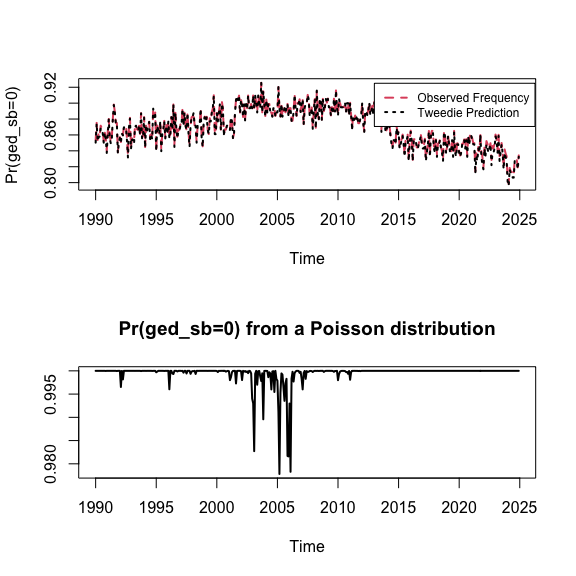

VIEWS Data Setup and Modeling Demo
================
Patrick T. Brandt
March 18, 2025

- [Introduction](#introduction)
- [Country-Month Data setup](#country-month-data-setup)
  - [Basic data manip for
    country-months](#basic-data-manip-for-country-months)
- [Basic Time Series Plots of all the SB killings
  data](#basic-time-series-plots-of-all-the-sb-killings-data)
- [Distributional summaries](#distributional-summaries)
  - [Fit Tweedie models](#fit-tweedie-models)
  - [Time series parameter summaries](#time-series-parameter-summaries)
- [Simple prediction models](#simple-prediction-models)
- [PRIO-Grid Month (`pgm`) Data setup](#prio-grid-month-pgm-data-setup)

# Introduction

This demo shows how to read and process the initial data from VIEWS /
UCDP. This is based on the data from [VIEWS](https://viewsforecast.org).
Here the files are downloaded from the Dropbox location for the data.
Alternative version would be direct calls to the
[API](https://github.com/prio-data/views_api/wiki/Available-datasets)

# Country-Month Data setup

Here begin with setting up the training data as provided by
[ViEWS](https://viewsforecasting.org/prediction-competition-2/). This
takes the data as given from ViEWS and reads it into several data frames
and some subsets.

### Reading in data

Now these are compressed, which means there are only data for all
observations that are observed.

*If you run your own version of this, you will likely need to change the
paths to the input files.* You can get the codebooks and input files
[here](https://www.dropbox.com/sh/yxk5w04p2e1xtqk/AACU2k5EUOuEeMq2kZ3gpZZwa?dl=0).

``` r
# CM level data: features and outcomes
dl_link <- "https://www.dropbox.com/scl/fo/rurpcmtpcquni5onoyuus/AM3DF4JXxM3cthQLt-S4pnE/features/cm/cm_features.parquet?rlkey=v1o4va647qrwc4la7m8i7cedk&e=1&st=wtqiw2z5&dl=1"
destfile <- "cm_features.parquet"

# DL with curl
curl::curl_download(url = dl_link, destfile = destfile)

# For the parquet files load the `arrow` package
library(arrow)
```

    ## Some features are not enabled in this build of Arrow. Run `arrow_info()` for more information.

    ## 
    ## Attaching package: 'arrow'

    ## The following object is masked from 'package:utils':
    ## 
    ##     timestamp

``` r
# This is the main data file
cm <- read_parquet("cm_features.parquet")

# Get the list of country names as well to add to the data
dl_link2 <- "https://www.dropbox.com/scl/fo/rurpcmtpcquni5onoyuus/AGeR6dD-Ru-Emwn06HnKAE8/matching_tables?preview=countries.csv&rlkey=v1o4va647qrwc4la7m8i7cedk&subfolder_nav_tracking=1&st=goucd0hg&dl=1"

destfile2 <- "country.zip"

# DL with curl
curl::curl_download(url = dl_link2, destfile = destfile2)

# Unzip
zip::unzip(zipfile = "country.zip", exdir="countries")

# Read it
countries <- read.csv("countries/countries.csv", header = TRUE)

# Month to date maps
dl_link3 <- "https://www.dropbox.com/scl/fo/rurpcmtpcquni5onoyuus/AGeR6dD-Ru-Emwn06HnKAE8/matching_tables?preview=month_ids.csv&rlkey=v1o4va647qrwc4la7m8i7cedk&subfolder_nav_tracking=1&st=l8g86mv4&dl=1"

destfile3 <- "month_ids.zip"
curl::curl_download(url = dl_link3, destfile = destfile3)
zip::unzip(zipfile = "month_ids.zip", exdir="month_ids")
month_ids <- read.csv("month_ids/month_ids.csv", header = TRUE)
```

(Note the above will also have downloaded the `pgm` items for the months
and the countries, so this is available for later processing.)

## Basic data manip for country-months

Here we see how to align the dates and country codes so that the
identifiers can always be put back into the data for case
identifications.

``` r
# Subset out the main (conflict) variables we want
df1 <- subset(cm, select = c(month_id, country_id, gleditsch_ward,
                             ged_sb, ged_ns, ged_os, 
                             acled_sb, acled_sb_count, acled_os))

# Merge on the country label data
dfs <- merge(df1, countries, 
             by.x = "gleditsch_ward", by.y="gwcode")

# Merge on the time periods info
dfs <- merge(dfs, month_ids[,2:4],
             by.x = "month_id", by.y="month_id")

# Clean up
rm(df1)
```

# Basic Time Series Plots of all the SB killings data

This summarizes and plots the GED state-based (SB) deaths series.

``` r
#### Simple plots as checks ####

# Simple summary plot to see that we have things correct...
ms <- sort(unique(cm$month_id))

roll.ged.sb <- matrix(NA, nrow=length(ms), ncol=3)
sbdata <- vector(mode="list", length=length(ms))

for(i in 1: length(ms))
{
  sb <- cm[cm$month_id==ms[i],4] 
  sbdata[[i]] <- as.vector(unlist(sb))
  roll.ged.sb[i,] <- c(ms[i], mean(sbdata[[i]]), sd(sbdata[[i]]))
}

rm(sb)

roll.ged.sb <- ts(roll.ged.sb[,2:3], start=c(1990,1), freq=12)

colnames(roll.ged.sb) <- c("Mean SB", "Std.Dev. SB")

plot(roll.ged.sb, lwd=2, col=1:2, main="", 
     cex.lab=0.9, cex.axis=0.7)
```


# Distributional summaries

Here we look at the main variable from GED, the state-based deaths in
the `ged_sb` variable. (This can be repeated later for the other target
measures in the `dfs` object.)

One can generate the `Unknown Pleasures` plot using the demo from
[here](https://cran.r-project.org/web/packages/ggridges/vignettes/introduction.html).

``` r
library(dplyr)
```

    ## 
    ## Attaching package: 'dplyr'

    ## The following objects are masked from 'package:stats':
    ## 
    ##     filter, lag

    ## The following objects are masked from 'package:base':
    ## 
    ##     intersect, setdiff, setequal, union

``` r
library(ggplot2)
library(ggridges)

# Plot the distributions by year
ggplot(dfs, aes(x = ged_sb, y = Year, group = Year)) + geom_density_ridges2()
```

    ## Picking joint bandwidth of 87.8


## Fit Tweedie models

This is a stability check on the data: can we even really generalize an
ED like target density?

``` r
library(tweedie)
library(statmod)

oneperiod.fit <- function(y, xi.vec=seq(1.45, 1.775, by=0.005))
{
  out <- tweedie.profile(y~1, xi.vec=xi.vec, 
                         do.plot=FALSE, do.smooth=FALSE,
                         glm.control(maxit=100),
                         method="series")
  return(list(phi = out$phi.max, xi = out$xi.max))
}


# Do explicit parallelization here over nodes.  
# Note this can be made more elegant with the `parallel` package.

library(snow)

nodes <- 8 # Number of cores to use in parallel
cl <- makeCluster(spec=nodes, type="SOCK")
clusterEvalQ(cl, library(tweedie))
```

    ## [[1]]
    ## [1] "tweedie"   "snow"      "stats"     "graphics"  "grDevices" "utils"    
    ## [7] "datasets"  "methods"   "base"     
    ## 
    ## [[2]]
    ## [1] "tweedie"   "snow"      "stats"     "graphics"  "grDevices" "utils"    
    ## [7] "datasets"  "methods"   "base"     
    ## 
    ## [[3]]
    ## [1] "tweedie"   "snow"      "stats"     "graphics"  "grDevices" "utils"    
    ## [7] "datasets"  "methods"   "base"     
    ## 
    ## [[4]]
    ## [1] "tweedie"   "snow"      "stats"     "graphics"  "grDevices" "utils"    
    ## [7] "datasets"  "methods"   "base"     
    ## 
    ## [[5]]
    ## [1] "tweedie"   "snow"      "stats"     "graphics"  "grDevices" "utils"    
    ## [7] "datasets"  "methods"   "base"     
    ## 
    ## [[6]]
    ## [1] "tweedie"   "snow"      "stats"     "graphics"  "grDevices" "utils"    
    ## [7] "datasets"  "methods"   "base"     
    ## 
    ## [[7]]
    ## [1] "tweedie"   "snow"      "stats"     "graphics"  "grDevices" "utils"    
    ## [7] "datasets"  "methods"   "base"     
    ## 
    ## [[8]]
    ## [1] "tweedie"   "snow"      "stats"     "graphics"  "grDevices" "utils"    
    ## [7] "datasets"  "methods"   "base"

``` r
clusterSetupRNGstream(cl)
```

    ## Loading required namespace: rlecuyer

``` r
#clusterExport(cl, "xi.vec")
clusterExport(cl, "oneperiod.fit")

# Now fit them all at once!
system.time(all.tw <- clusterApplyLB(cl, sbdata, oneperiod.fit))
```

    ##    user  system elapsed 
    ##   0.101   0.040  53.600

``` r
stopCluster(cl)
```

## Time series parameter summaries

Plot summaries of the key parameters of the Tweedie models for each time
period (month).

``` r
# Now summarize the results
all.tw.sum <- matrix(unlist(all.tw), ncol=2, byrow = TRUE)

# Now make some plots to see what changes over time

twp <- cbind(roll.ged.sb, all.tw.sum)
colnames(twp) <- c("Mean", "Std Dev.", "phi", "p")

# Make a plot to see what changes over time
plot(twp, main="")
```


Now plot the probability of a zero count from the Tweedie, Poisson, and
data for comparison.

``` r
# Convert using Dunn and Smyth formula
twp.convert <- sapply(1:nrow(twp), 
                      function(i) tweedie.convert(xi = twp[i,"p"], 
                                                  mu=twp[i,"Mean"], 
                                                  phi=twp[i,"phi"]),
                     USE.NAMES = FALSE)

twp.convert <- as.data.frame(matrix(unlist(twp.convert), 
                                    ncol=6, byrow=TRUE))
colnames(twp.convert) <- c("poisson.lambda", 
                           "gamma.scale", "gamma.shape",
                           "p0", "gamma.mean", "gamma.phi")

# Compute the observed zeros proportion by month and plot against the predictions:
freq.zeros <- aggregate(cm$ged_sb==0,
                        by=list(cm$month_id), mean)

# Poisson predictions make no sense
# range(dpois(0, lambda=roll.ged.sb[,1]))

plot(ts(cbind(twp.convert$p0, freq.zeros[,2]), 
        start=c(1990,1), freq=12),
     plot.type="single", lwd=2, lty=2:3, col=2:1, 
     ylab = "Pr(ged_sb=0)")

legend(2013, 0.925, 
       c("Observed Frequency", "Tweedie Prediction"), col=2:1,
       lty=2:3, lwd=2, cex=0.75)
```



# Simple prediction models

### Basic count regressions

### Count regressions with GAM / splines

# PRIO-Grid Month (`pgm`) Data setup
